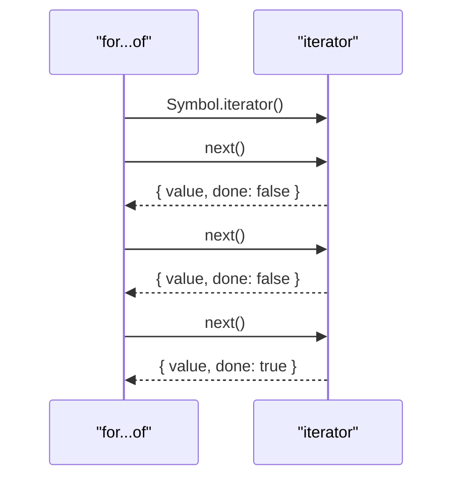

# Iterators & Generators

Ця тема пояснює, що перебір у JavaScript — це **protocol**, а не магія `for...of`. Саме через цей протокол працюють масиви, рядки, `Map`, `Set`, generators і будь-які custom iterables.

---

## I. Core Mechanism

**Теза:** `Iterable` — це об'єкт, який має `Symbol.iterator()`. `Iterator` — це об'єкт із `next()`, який повертає `{ value, done }`. `Generator` — це зручний синтаксичний спосіб створювати iterator-логіку зі збереженням execution state.

### Приклад
```javascript
function* range(start, end) {
  for (let i = start; i <= end; i++) {
    yield i;
  }
}

for (const value of range(1, 3)) {
  console.log(value);
}
```

### Просте пояснення
`for...of` не знає нічого конкретного про масив чи generator. Він лише просить об'єкт: “дай мені iterator”, а потім багато разів викликає `next()`.

### Технічне пояснення
Ключові частини протоколу:

| Частина | Що робить |
| :--- | :--- |
| **`Symbol.iterator`** | Повертає iterator |
| **`next()`** | Повертає `{ value, done }` |
| **`done: false`** | Є наступне значення |
| **`done: true`** | Перебір завершено |
| **`function*`** | Створює generator object, який одночасно iterable і iterator |

Generator зберігає internal execution state між викликами `next()`. `yield` повертає value назовні й ставить виконання на pause.

### Mental Model
Iterator — це “машинка видачі наступного елемента”. Generator — це зручний спосіб написати цю машинку без ручного зберігання індексу й стану.

### Покроковий Walkthrough
1. `for...of` викликає `obj[Symbol.iterator]()`.
2. Отримує iterator object.
3. Багато разів викликає `next()`.
4. Читає `value` поки `done === false`.
5. Зупиняється, коли `done === true`.

> [!TIP]
> **[▶ Відкрити Iterator Protocol Board](../../visualisation/modules-ecosystem-and-meta-programming/02-iterators-and-generators/iterator-protocol-board/index.html)**

> [!TIP]
> **[▶ Відкрити Generator Yield Board](../../visualisation/modules-ecosystem-and-meta-programming/02-iterators-and-generators/generator-yield-board/index.html)**

### Візуалізація


### Edge Cases / Підводні камені
- Якщо iterator ніколи не повертає `done: true`, перебір може стати нескінченним.
- Якщо `value`/`done` shape неправильна, поведінка стає ламкою.
- Generator — не async primitive сам по собі.
- Custom iterator з ручним state management легко зламати помилкою індексу чи завершення.

---

## II. Common Misconceptions

> [!IMPORTANT]
> Generator не є “майже Promise”. Це синхронний iterator mechanism, якщо не йдеться про `async function*`.

> [!IMPORTANT]
> `for...of` працює не з “масивами взагалі”, а з iterable protocol.

> [!IMPORTANT]
> Iterator і iterable — не завжди один і той самий об'єкт, хоча generator часто поєднує обидві ролі.

---

## III. When This Matters / When It Doesn't

- **Важливо:** custom data traversal, lazy sequences, protocol design, generator-based workflows.
- **Менш важливо:** простий доступ до масивів без потреби у custom iteration.

---

## IV. Self-Check Questions

1. Що таке iterable?
2. Що таке iterator?
3. Яку форму має результат `next()`?
4. Що робить `Symbol.iterator`?
5. Чому `for...of` не прив'язаний саме до масивів?
6. Чим generator полегшує iterator logic?
7. Що робить `yield`?
8. Чому generator треба відділяти від async semantics?
9. Коли custom iterator корисний?
10. Яка типова поломка в manual iterator?
11. Чим generator object відрізняється від plain function result?
12. Коли краще manual iterator, а коли generator?
13. Чому iterable і iterator корисно розділяти як дві ролі, навіть якщо generator часто поєднує їх?
14. Що ламається, коли `next()` повертає shape, який лише схожий на `{ value, done }`, але не дотримується contract?
15. Коли generator робить код читабельнішим, а коли приховує занадто багато control flow?
16. Який smell підказує, що протокол перебору спроєктований неправильно, а не просто “цикл не той”?

---

## V. Short Answers / Hints

1. Має `Symbol.iterator`.
2. Має `next()`.
3. `{ value, done }`.
4. Повертає iterator.
5. Бо він працює через protocol.
6. Ховає ручне state management.
7. Видає value і pause-ить execution.
8. Бо це інший механізм.
9. Для lazy traversal і custom collections.
10. Неправильний `done` або state.
11. Має resume-able execution state.
12. Generator зазвичай простіший для читання.
13. Бо producer API і actual traversal state — це різні обов'язки.
14. Consumer починає працювати на хибних припущеннях і цикл стає ламким.
15. Коли state machine короткий і лінійний; гірше, коли логіка занадто неявна.
16. Нескінченні цикли, брехливий `done`, нестабільний output або незрозумілий ownership state.

---

## VI. Suggested Practice

1. Напиши custom iterable для range.
2. Реалізуй той самий range вручну як iterator і через generator.
3. Після цього переходь у [03 Proxy & Reflect](../03-proxy-and-reflect/README.md), бо там теж важливо мислити в термінах protocol/interception, а не поверхневого API.
