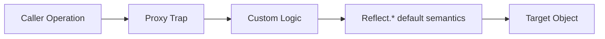

# Proxy & Reflect

Ця тема пояснює шар JavaScript, який дозволяє **перехоплювати object operations**: читання, запис, перевірку наявності, видалення ключів, перерахування властивостей. Саме тут лежать основи реактивності, обсервабельності й багатьох meta-programming технік.

---

## I. Core Mechanism

**Теза:** `Proxy` дає interception layer над target object. `Reflect` дає стандартний спосіб викликати default semantics усередині trap-ів. Разом вони дозволяють змінювати поведінку object operations без переписування самого target.

### Приклад
```javascript
const user = { name: 'Ann' };

const proxy = new Proxy(user, {
  get(target, key, receiver) {
    console.log('read', key);
    return Reflect.get(target, key, receiver);
  },
  set(target, key, value, receiver) {
    console.log('write', key, value);
    return Reflect.set(target, key, value, receiver);
  }
});

proxy.name;
proxy.name = 'Ira';
```

### Просте пояснення
Замість прямої роботи з об'єктом ти ставиш “перехоплювач”. Коли код читає або пише властивість, спочатку спрацьовує trap у `Proxy`.

### Технічне пояснення
Ключові trap-и:

| Trap | Перехоплює |
| :--- | :--- |
| **get** | Читання властивості |
| **set** | Запис властивості |
| **has** | Оператор `in` |
| **deleteProperty** | `delete obj.key` |
| **ownKeys** | `Object.keys`, `Reflect.ownKeys` |

`Reflect` важливий не просто як зручність. Він допомагає:

- делегувати default behavior
- не дублювати вручну semantics built-in operations
- менше ризикувати зламаними invariant-ами

### Mental Model
`Proxy` — це не “розумний object”. Це interception boundary між caller і target.

### Покроковий Walkthrough
1. Caller робить операцію над proxy.
2. Runtime шукає відповідний trap.
3. Trap може логувати, змінювати, блокувати або делегувати поведінку.
4. Через `Reflect.*` можна виконати стандартну операцію поверх target.
5. Якщо invariant зламаний, runtime кидає помилку.

> [!TIP]
> **[▶ Відкрити Proxy Reflect Flow Board](../../visualisation/modules-ecosystem-and-meta-programming/03-proxy-and-reflect/proxy-reflect-flow-board/index.html)**

> [!TIP]
> **[▶ Відкрити Proxy Reactivity Board](../../visualisation/modules-ecosystem-and-meta-programming/03-proxy-and-reflect/proxy-reactivity-board/index.html)**

### Візуалізація


### Edge Cases / Підводні камені
- Trap може випадково викликати сам себе й створити recursion bug.
- Не всі object invariants можна порушувати без наслідків.
- Proxy ускладнює debugging, бо поведінка об'єкта вже не очевидна з shape target.
- Reactive magic на proxy не скасовує runtime cost і складність reasoning.

---

## II. Common Misconceptions

> [!IMPORTANT]
> `Proxy` не робить object "реактивним" сам по собі. Реактивність — це ще й dependency tracking logic поверх interception.

> [!IMPORTANT]
> `Reflect` — не “дубль Object API”. Він потрібен для коректної делегації semantics.

> [!IMPORTANT]
> Proxy traps не дають безкарно ламати internal invariants.

---

## III. When This Matters / When It Doesn't

- **Важливо:** reactive systems, logging/interception, security wrappers, instrumentation, virtualization.
- **Менш важливо:** простий data object без потреби в interception.

---

## IV. Self-Check Questions

1. Що робить `Proxy`?
2. Для чого потрібен `Reflect`?
3. Що перехоплює trap `get`?
4. Що перехоплює trap `set`?
5. Чому trap легко може зламати semantics об'єкта?
6. Що таке invariant у контексті `Proxy`?
7. Чому proxy-based reactivity — це не просто “змінив set trap”?
8. Який типовий recursion bug у trap-ах?
9. Коли `Reflect.get` краще за manual property access усередині trap?
10. Чому `Proxy` ускладнює debugging?
11. Коли `Proxy` виправданий, а коли це over-engineering?
12. Чому interception layer і target object треба мислити окремо?
13. Чому trap, який “працює в demo”, може бути небезпечним у real object graph?
14. Чим logging proxy відрізняється за ризиком від policy-enforcing proxy?
15. Який smell показує, що `Proxy` використаний як магічна заміна нормальної моделі даних?
16. Коли краще явний API або wrapper, а не глобальний interception через proxy?

---

## V. Short Answers / Hints

1. Перехоплює object operations.
2. Для default semantics delegation.
3. Read property.
4. Write property.
5. Бо trap може змінити або зламати стандартну поведінку.
6. Runtime rule, який не можна порушити.
7. Потрібен ще tracking/triggering layer.
8. Trap читає/пише через той самий proxy знову.
9. Бо це ближче до стандартної semantics.
10. Поведінка більше не читається лише з target shape.
11. Коли є реальна потреба в interception.
12. Бо proxy — boundary, а не самі дані.
13. Бо edge cases receiver/prototype/invariants не видно в маленькому прикладі.
14. Logging зазвичай пасивний; policy trap частіше ламає semantics і expectations.
15. Коли через proxy маскують неясну бізнес-логіку замість явної моделі.
16. Коли потрібна прозорість, простий control flow і нижчий debugging cost.

---

## VI. Suggested Practice

1. Напиши logging proxy через `get`/`set`.
2. Зроби маленький reactive tracker на концептуальному рівні.
3. Після цього переходь у [04 Intl API & Globalization](../04-intl-api-and-globalization/README.md), бо там теж важливо мислити не string helpers, а runtime semantics.
