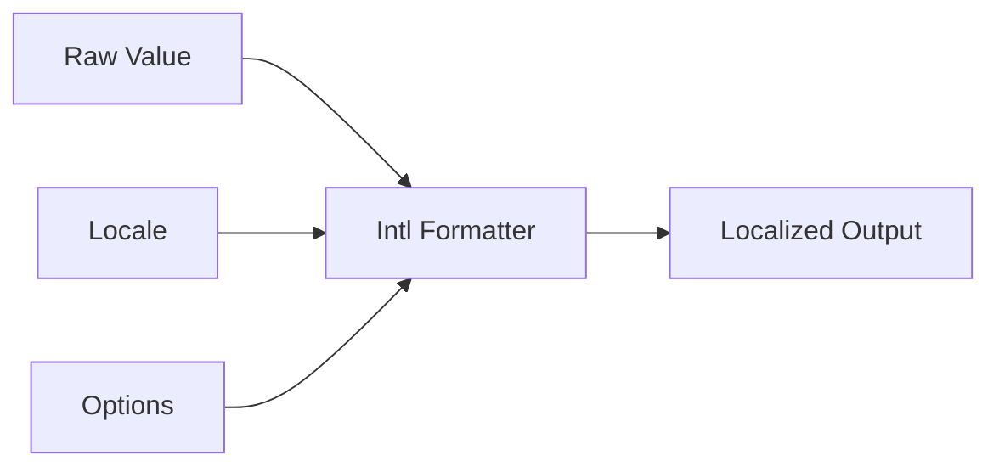

# Intl API & Globalization

Ця тема пояснює, як форматувати дати, числа, валюти й plural forms **через runtime**, а не вручну строками. `Intl` — це не косметичний helper, а спосіб робити UI і звіти коректними для різних локалей.

---

## I. Core Mechanism

**Теза:** `Intl` дає locale-aware formatter objects. Правильна робота з ним — це не нескінченні `.toLocaleString(...)`, а **явно створені formatter-и**, які перевикористовуються й контролюються через options.

### Приклад
```javascript
const priceFormatter = new Intl.NumberFormat('uk-UA', {
  style: 'currency',
  currency: 'UAH'
});

priceFormatter.format(12345.67);
```

### Просте пояснення
Одна й та сама сума, дата або plural форма повинна показуватися по-різному залежно від локалі. `Intl` робить це не “на око”, а за правилами runtime.

### Технічне пояснення
Найважливіші інструменти:

| API | Для чого |
| :--- | :--- |
| **Intl.NumberFormat** | Числа, валюти, відсотки |
| **Intl.DateTimeFormat** | Дати й час |
| **Intl.RelativeTimeFormat** | “3 days ago”, “через 2 години” |
| **Intl.PluralRules** | plural categories |

Практичні правила:

- створюй formatter один раз і reuse-и його
- не покладайся на default locale, якщо продукт має явні locale requirements
- перевіряй `resolvedOptions()`, коли треба зрозуміти фактичну конфігурацію runtime

### Mental Model
`Intl` — це не “переформатуй рядок”, а “застосуй locale rules до значення”.

### Покроковий Walkthrough
1. Обери locale.
2. Обери formatter type.
3. Передай explicit options.
4. Перевикористовуй formatter для багатьох значень.
5. Якщо поведінка дивна — подивись у `resolvedOptions()`.

> [!TIP]
> **[▶ Відкрити Intl Formatting Board](../../visualisation/modules-ecosystem-and-meta-programming/04-intl-api-and-globalization/intl-formatting-board/index.html)**

### Візуалізація


### Edge Cases / Підводні камені
- Створення formatter-а на кожному render може бути зайвим hot-path cost.
- `toLocaleString()` без явної locale/option strategy часто дає inconsistent results.
- Валюта, дата й plural logic — це бізнес-вимоги, а не “presentation afterthought”.
- Runtime locale support може відрізнятися між environments.

---

## II. Common Misconceptions

> [!IMPORTANT]
> `Intl` — не лише про переклад тексту. Це про locale-aware formatting rules.

> [!IMPORTANT]
> `.toLocaleString()` не є автоматично “достатньо хорошим рішенням” для серйозного продукту.

> [!IMPORTANT]
> Formatter object краще reuse-ити, ніж створювати на кожен виклик без потреби.

---

## III. When This Matters / When It Doesn't

- **Важливо:** international products, finance, reports, dashboards, dates, currencies, localization-sensitive UI.
- **Менш важливо:** throwaway demo без locale requirements.

---

## IV. Self-Check Questions

1. Для чого потрібен `Intl.NumberFormat`?
2. Для чого потрібен `Intl.DateTimeFormat`?
3. Для чого потрібен `Intl.RelativeTimeFormat`?
4. Для чого потрібен `Intl.PluralRules`?
5. Чому formatter object краще reuse-ити?
6. Чому `.toLocaleString()` не завжди достатньо?
7. Що показує `resolvedOptions()`?
8. Чому locale formatting треба вважати частиною runtime semantics?
9. Яка проблема в implicit default locale?
10. Коли inconsistent currency/date formatting стає product bug, а не cosmetic issue?
11. Чому `Intl` важливий навіть для backend/reporting code?
12. Яка головна practical помилка при роботі з `Intl`?
13. Чому “formatted string already looks fine on my machine” нічого не доводить?
14. Коли треба кешувати formatter-и, а коли це передчасна оптимізація?
15. Чому locale-aware formatting треба виносити в явний application policy?
16. Який smell підказує, що в продукті немає цілісної globalization strategy?

---

## V. Short Answers / Hints

1. Format numbers/currency.
2. Format dates/time.
3. Format relative time.
4. Choose plural category.
5. Менше зайвих алокацій і стабільніша стратегія.
6. Бо він часто неявний і неконтрольований.
7. Фактичні runtime options.
8. Бо це правила представлення значення в locale context.
9. Результат може відрізнятися між environments.
10. Коли користувач бачить неправильний формат грошей/дати.
11. Бо reports і exports теж locale-sensitive.
12. Створювати formatter хаотично або без чіткої locale strategy.
13. Бо locale bugs часто проявляються лише в іншому environment або ринку.
14. Коли одна й та сама конфігурація використовується багато разів у hot path.
15. Щоб формат грошей, дат і plural rules не роз'їжджався між екранами.
16. Різні частини продукту форматують однакові значення по-різному і без explicit locale source.

---

## VI. Suggested Practice

1. Створи formatter-и для `uk-UA`, `en-US`, `de-DE` і порівняй outputs.
2. Подивись у `resolvedOptions()` для `currency` і `dateStyle` конфігурацій.
3. Після цього переходь у [05 Practice Lab](../05-practice-lab/README.md), щоб закрити весь блок практикою.
