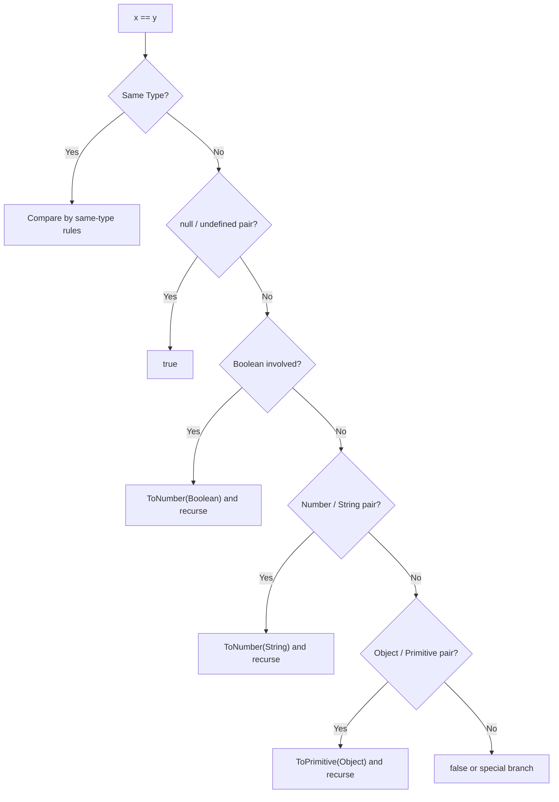
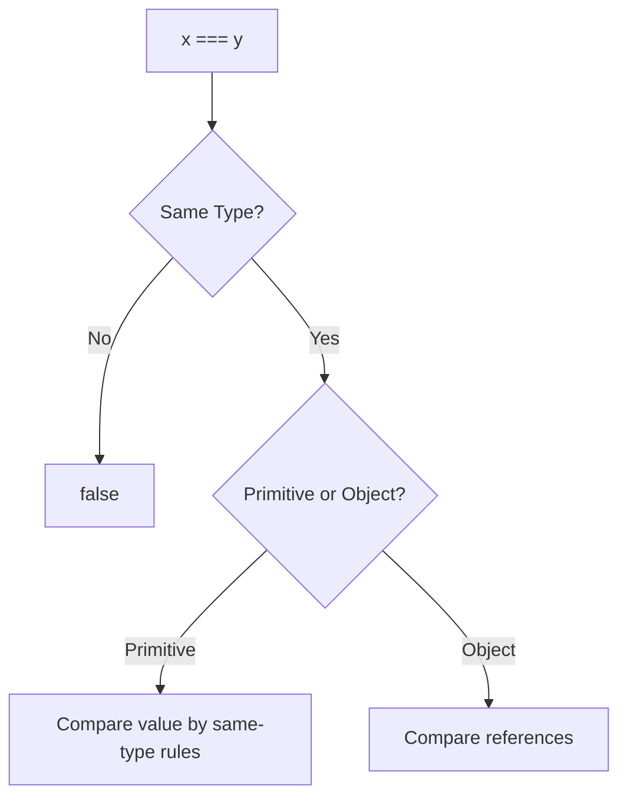
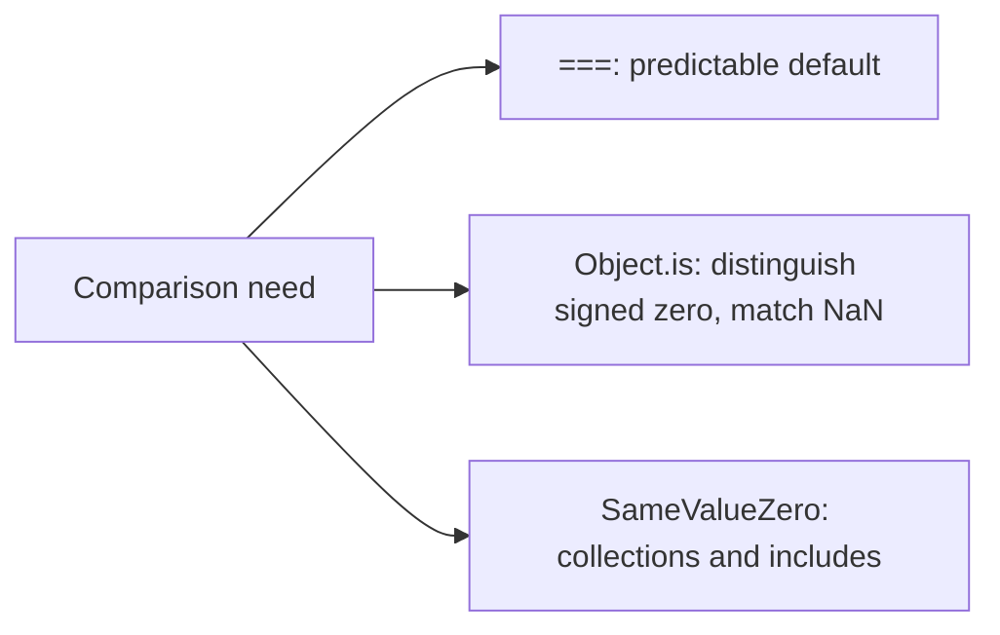

# 01. Abstract Equality vs Strict Equality

`==` і `===` — це не "м'яка" і "сувора" версії одного й того ж оператора. Це різні алгоритми зі специфікації, з різними правилами, edge cases і ментальними моделями.

---

## I. Abstract Equality (`==`)

**Теза:** `Abstract Equality Comparison` намагається звести значення до сумісної форми перед фінальним порівнянням. Саме ця каскадна конверсія робить `==` одночасно зручним і небезпечним.

### Приклад
```javascript
42 == "42";           // true
null == undefined;    // true
[] == false;          // true
[] == ![];            // true
```

### Просте пояснення
`==` не просто питає "чи однакові значення?". Він спочатку питає: "чи можу я перетворити їх у щось порівнюване?". Через це один і той самий вираз може пройти через кілька етапів: `Boolean -> Number`, `Object -> Primitive`, `String -> Number`.

### Технічне пояснення
Алгоритм `==` у ECMA-262 не є симетричним "coerce everything to string" або "coerce everything to number". Він має набір конкретних гілок:

1. Якщо типи однакові — далі використовується логіка, близька до `===`.
2. `null` і `undefined` рівні лише один одному.
3. `Number` vs `String` — рядок проходить через `ToNumber`.
4. `Boolean` ніколи не порівнюється "як є": він іде через `ToNumber(true) -> 1`, `ToNumber(false) -> 0`.
5. `Object` vs primitive — об'єкт проходить через `ToPrimitive`.
6. Для `BigInt` є окремі гілки, і вони вже не зводяться до старої простої моделі з `Number` та `String`.

### Візуалізація


> [!TIP]
> **[▶ Запустити інтерактивний симулятор (Abstract Equality: `[] == ![]`)](../../visualisation/type-system/01-abstract-equality/index.html)**

### Edge Cases / Підводні камені

#### `[] == ![]`
```javascript
[] == ![]; // true
```

Розбір:

1. `![]` обчислюється першим.
2. Будь-який object truthy, тому `![]` дає `false`.
3. Маємо `[] == false`.
4. `false` переходить у `0`.
5. `[]` переходить через `ToPrimitive` у `""`.
6. `""` переходить через `ToNumber` у `0`.
7. Лишається `0 == 0`, тобто `true`.

#### Корисний виняток: `x == null`
```javascript
value == null
```

Це один з небагатьох випадків, де `==` часто використовується свідомо. Такий вираз перевіряє одразу `null` і `undefined`, але не чіпає `0`, `false` чи `""`.

---

## II. Strict Equality (`===`)

**Теза:** `Strict Equality Comparison` не робить неявного приведення типів. Він дає набагато передбачуванішу поведінку, але має свої специфікаційні edge cases: `NaN` і signed zero.

### Приклад
```javascript
42 === "42";          // false
null === undefined;   // false
{} === {};            // false
NaN === NaN;          // false
+0 === -0;            // true
```

### Просте пояснення
`===` спершу дивиться на типи. Якщо типи різні — відповідь одразу `false`. Якщо типи однакові, він порівнює або саме значення, або object identity.

### Технічне пояснення
Для `===` важливі три групи правил:

1. **Primitives:** однаковий тип і однакове значення.
2. **Objects:** лише одна й та сама reference identity.
3. **Numbers:** `NaN` ніколи не дорівнює нічому, навіть собі; `+0` і `-0` вважаються рівними.

> [!IMPORTANT]
> `===` не треба продавати як "завжди швидший". Головна перевага — не магічна швидкість, а передбачуваність і менший когнітивний шум. На практиці це майже завжди цінніше.

### Візуалізація


### Edge Cases / Підводні камені

#### Object identity
```javascript
{} === {}; // false
```

Дві object literals створюють дві різні allocation points у пам'яті. Структура однакова, identity різна.

#### `NaN`
```javascript
NaN === NaN; // false
```

Це не баг JavaScript, а властивість numeric model IEEE-754.

---

## III. `Object.is()` і SameValue

**Теза:** `===` — не найточніше порівняння у мові. Для деяких системних задач важливий алгоритм `SameValue`, доступний через `Object.is()`.

### Приклад
```javascript
Object.is(NaN, NaN); // true
Object.is(+0, -0);   // false
```

### Просте пояснення
`Object.is()` схожий на `===`, але він виправляє два найбільш відомі edge cases: `NaN` і signed zero.

### Технічне пояснення
- `===` використовує правила `Strict Equality Comparison`.
- `Object.is()` реалізує `SameValue`.
- Окремо в мові існує `SameValueZero` — його використовують, наприклад, `Set`, `Map` і `Array.prototype.includes`, де `NaN` вважається рівним `NaN`, а `+0` і `-0` не розрізняються.

### Візуалізація


> [!TIP]
> **[▶ Запустити інтерактивний візуалізатор (=== vs Object.is vs SameValueZero)](../../visualisation/type-system/01-abstract-vs-strict-equality/equality-algorithms/index.html)**

### Edge Cases / Підводні камені
> [!CAUTION]
> Якщо ви порівнюєте значення для кешування, memoization або low-level math logic, перевірте, який саме алгоритм рівності вам потрібен. `===` не завжди достатній.

---

## IV. Common Misconceptions

> [!IMPORTANT]
> `==` не є "зламаним" оператором. Він просто кодує legacy-compatible правила coercion, які треба знати буквально, а не інтуїтивно.

> [!IMPORTANT]
> `===` не означає "глибока рівність". Для objects це лише reference identity.

> [!IMPORTANT]
> `Object.is()` не є "кращим `===` для всього". Це інший алгоритм для конкретних edge cases.

---

## V. When This Matters / When It Doesn't

- **Важливо:** API boundaries, form input, data validation, filters, search, memoization, collection membership, code review.
- **Менш важливо:** короткі локальні приклади, де типи вже жорстко контролюються й операція очевидна з контексту.

---

## VI. Self-Check Questions

1. Чому `null == undefined` дає `true`, але `null === undefined` дає `false`?
2. Який ланцюжок coercion проходить `[] == false`?
3. Чому `{} === {}` завжди `false`, навіть якщо об'єкти структурно однакові?
4. У чому різниця між `===` і `Object.is()` для `NaN`?
5. Чому `+0 === -0`, але `Object.is(+0, -0)` дає `false`?
6. Коли `value == null` може бути свідомим і коректним стилем?
7. Який алгоритм ближче до поведінки `Set` та `Array.prototype.includes`: `===`, `SameValue` чи `SameValueZero`?
8. Чому `===` не можна називати "deep equality" навіть у навчальному поясненні?
9. Що в цьому коді потенційно небезпечно з точки зору читабельності і чому?
```javascript
if (input == 0) {
  // ...
}
```
10. Як би ви пояснили junior-розробнику, що проблема `==` не в "рандомності", а в конкретних алгоритмічних правилах?

---

## VII. Short Answers / Hints

1. `==` має спеціальне правило для пари `null` / `undefined`, а `===` вимагає однаковий тип.
2. `false -> 0`, `[] -> "" -> 0`, після чого лишається `0 == 0`.
3. Бо це різні object allocations, а не одна reference identity.
4. `Object.is(NaN, NaN)` дає `true`, `NaN === NaN` дає `false`.
5. `===` не розрізняє signed zero, `Object.is()` розрізняє.
6. Коли ви свідомо хочете перевірити "nullish" стан: `null` або `undefined`.
7. `SameValueZero`.
8. Бо для objects це лише порівняння посилань.
9. `input == 0` може несподівано зачепити `""`, `false`, `"0"` та інші coercion cases.
10. Пояснення має йти через конкретні гілки алгоритму, а не через фразу "JS дивний".
