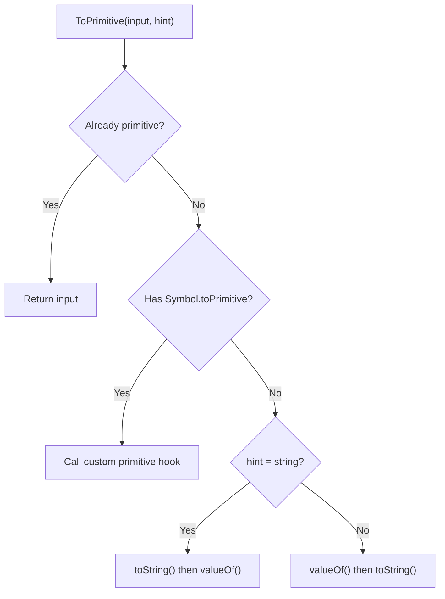
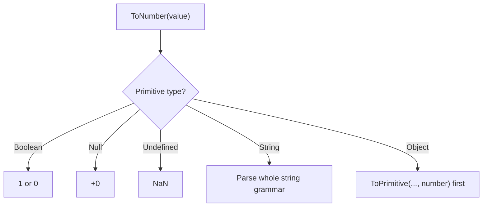
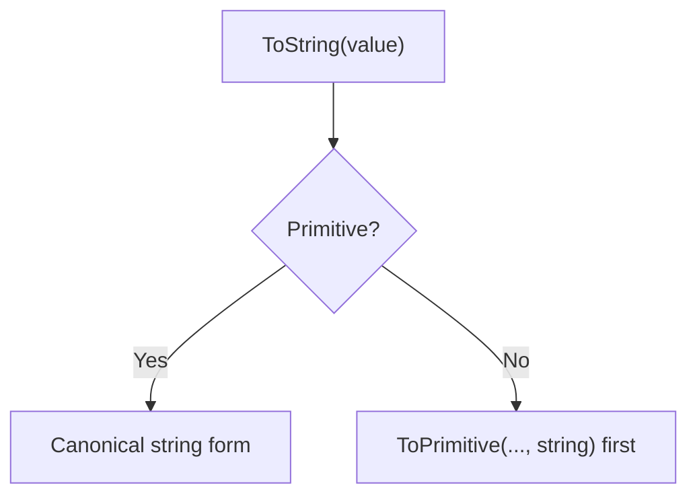
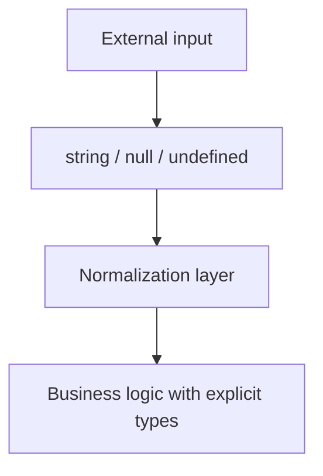

# 02. Primitive Coercion Algorithms

Неявне приведення типів у JavaScript — це не одна операція, а набір абстрактних алгоритмів зі специфікації. Найважливіші з них для повсякденного коду: `ToPrimitive`, `ToNumber`, `ToString`.

---

## I. `ToPrimitive`

**Теза:** `ToPrimitive` перетворює object у primitive value. Це ключовий міст між "об'єктним" і "числово/рядковим" світом мови.

### Приклад
```javascript
const user = {
  valueOf() { return 42; },
  toString() { return "user"; }
};

user + 1;      // 43
`${user}`;     // "user"
```

### Просте пояснення
Коли об'єкт потрапляє в операцію, де потрібен примітив, JavaScript намагається "спитати" у нього простіше значення. Залежно від контексту рушій очікує або число, або рядок, і саме від цього залежить порядок викликів.

### Технічне пояснення
Алгоритм іде в такому порядку:

1. Якщо значення вже primitive — повернути як є.
2. Якщо є `[Symbol.toPrimitive]`, викликати його першим.
3. Інакше застосувати `OrdinaryToPrimitive`.
4. Для hint `"string"` порядок такий: `toString()` -> `valueOf()`.
5. Для hint `"number"` або `"default"` порядок зазвичай такий: `valueOf()` -> `toString()`.
6. Для `Date` і `Symbol` wrapper objects `default` поводиться особливо і ближче до `"string"`.
7. Якщо примітив так і не отримано — `TypeError`.

### Візуалізація


> [!TIP]
> **[▶ Запустити інтерактивний симулятор (ToPrimitive: `Object` vs `Date`)](../../visualisation/type-system/02-primitive-coercion/index.html)**

### Edge Cases / Підводні камені

#### `Date`
```javascript
const d = new Date();
String(d); // рядкове представлення
d + 1;     // часто теж рядковий шлях
d - 1;     // числовий шлях
```

`Date` — один із найважливіших legacy-винятків у coercion model.

#### Custom `[Symbol.toPrimitive]`
```javascript
const money = {
  amount: 10,
  [Symbol.toPrimitive](hint) {
    return hint === "string" ? "$10" : 10;
  }
};
```

Це найпряміший спосіб контролювати coercion об'єкта.

---

## II. `ToNumber`

**Теза:** `ToNumber` намагається інтерпретувати значення як number за правилами специфікації, а не "якось приблизно".

### Приклад
```javascript
Number("42");   // 42
Number("");     // 0
Number("42px"); // NaN
```

### Просте пояснення
`ToNumber` або отримує валідне число, або чесно каже "я не можу". Він не працює як `parseInt`, який готовий зупинитися посеред рядка.

### Технічне пояснення
- `undefined -> NaN`
- `null -> +0`
- `true -> 1`, `false -> +0`
- `"" -> 0`
- `" 42 " -> 42`
- `"42px" -> NaN`
- `object -> ToPrimitive(value, "number")`, а потім ще раз `ToNumber`

### Візуалізація


### Edge Cases / Підводні камені

#### Порожній рядок
```javascript
Number("");   // 0
"" == 0;      // true
```

Це один із найчастіших джерел багів у form input і query params.

#### `Number` vs `parseInt`
```javascript
Number("12px");   // NaN
parseInt("12px"); // 12
```

`parseInt` — це parser із ранньою зупинкою, а не аналог `ToNumber`.

---

## III. `ToString`

**Теза:** `ToString` перетворює значення на рядок за правилами мови, а не за правилами вашої UI-інтуїції.

### Приклад
```javascript
String(null);        // "null"
String(undefined);   // "undefined"
String([1, 2, 3]);   // "1,2,3"
```

### Просте пояснення
`ToString` дає канонічне рядкове представлення значення. Для arrays це часто означає "склей елементи через кому", а для objects — спочатку дійди до примітива.

### Технічне пояснення
- `undefined -> "undefined"`
- `null -> "null"`
- `boolean -> "true" / "false"`
- `number -> decimal string / special forms`
- `bigint -> decimal string without trailing n`
- `symbol ->` у багатьох неявних string coercion contexts кидає `TypeError`, тому для symbol values безпечніше думати категорією "явне `String(symbol)`", а не "автоматичний `ToString` завжди спрацює"`
- `object -> ToPrimitive(value, "string")`, потім `ToString`

### Візуалізація


### Edge Cases / Підводні камені

#### `obj + ""` vs template literal
```javascript
const obj = {
  valueOf: () => 10,
  toString: () => "ten"
};

obj + "";    // "10"
`${obj}`;    // "ten"
```

Бінарний `+` працює через `ToPrimitive(..., "default")`, тоді як template literal явно тягне рядковий шлях.

#### `Symbol`
```javascript
String(Symbol("id")); // "Symbol(id)"
"" + Symbol("id");    // TypeError
```

Не всі implicit string conversions для `Symbol` дозволені.

---

## IV. Coercion Patterns You Actually Meet

**Теза:** Найнебезпечніші coercion bugs виникають не в абстрактних тестах, а на межах системи: form input, URL params, API payloads, logging.

### Приклад
```javascript
const qty = formData.get("qty"); // "0" or ""

if (qty == 0) {
  // спрацює і для "0", і для ""
}
```

### Просте пояснення
Коли в систему приходять рядки, а бізнес-логіка очікує числа чи булі, coercion починає працювати "за вас". Саме тут і виникають непередбачені умови.

### Технічне пояснення
Неявне приведення майже ніколи не є проблемою всередині вже строго типізованої ділянки коду. Проблема з'являється на boundaries, де значення ще не нормалізоване.

### Візуалізація


### Edge Cases / Підводні камені
> [!WARNING]
> Якщо ви дозволяєте coercion вирішувати бізнес-логіку замість explicit normalization, баги будуть виглядати "магічними", хоча причина завжди алгоритмічна.

---

## V. Common Misconceptions

> [!IMPORTANT]
> `ToPrimitive`, `ToNumber` і `ToString` — це не "хаотичні фокуси рушія", а чіткі abstract operations зі специфікації.

> [!IMPORTANT]
> Template literal не еквівалентний `value + ""`. Вони можуть проходити різні шляхи coercion.

> [!IMPORTANT]
> `Number(value)` і `parseInt(value, 10)` вирішують різні задачі й не взаємозамінні.

---

## VI. When This Matters / When It Doesn't

- **Важливо:** input parsing, URL params, logging, arithmetic over user input, serialization boundaries, custom objects з `[Symbol.toPrimitive]`.
- **Менш важливо:** локальні ділянки, де тип уже зафіксований і ніякий coercion фактично не відбувається.

---

## VII. Self-Check Questions

1. Який порядок дій проходить object під час `ToPrimitive`, якщо в нього немає `[Symbol.toPrimitive]`?
2. Чому `Date` є винятком у coercion model?
3. Чому `Number("42px")` дає `NaN`, а `parseInt("42px", 10)` дає `42`?
4. Чому `Number("")` дає `0`, і де це особливо небезпечно?
5. У чому різниця між `obj + ""` і `` `${obj}` ``?
6. Який шлях coercion проходить object у виразі `obj == 1`?
7. Чому `String(symbol)` працює, а `"" + symbol` може впасти з `TypeError`?
8. Який найнадійніший рівень для приборкання coercion: в середині бізнес-логіки чи на boundary normalization layer?
9. Як би ви пояснили різницю між "парсингом рядка" і "специфікаційним ToNumber"?
10. Який практичний ризик у коду на кшталт:
```javascript
if (input == false) {
  // ...
}
```

---

## VIII. Short Answers / Hints

1. `[Symbol.toPrimitive]` -> інакше `OrdinaryToPrimitive` з порядком, що залежить від hint.
2. Бо для `default` hint його coercion-поведінка ближча до string path.
3. `Number` вимагає валідне число цілком, `parseInt` читає префікс і зупиняється.
4. Бо порожній рядок нормалізується в `0`; це небезпечно для form input і query params.
5. `obj + ""` іде через `default`, template literal тягне string-oriented coercion.
6. `ToPrimitive(obj)` -> далі порівняння з `1` за rules для `==`.
7. `String(symbol)` є явним шляхом, а `"" + symbol` проходить через інший coercion context і може кинути `TypeError`.
8. На boundary normalization layer.
9. `ToNumber` — це специфікаційна конверсія значення, а не lenient string parser.
10. Такий код може збігатися з набагато ширшим набором значень, ніж очікує автор.
