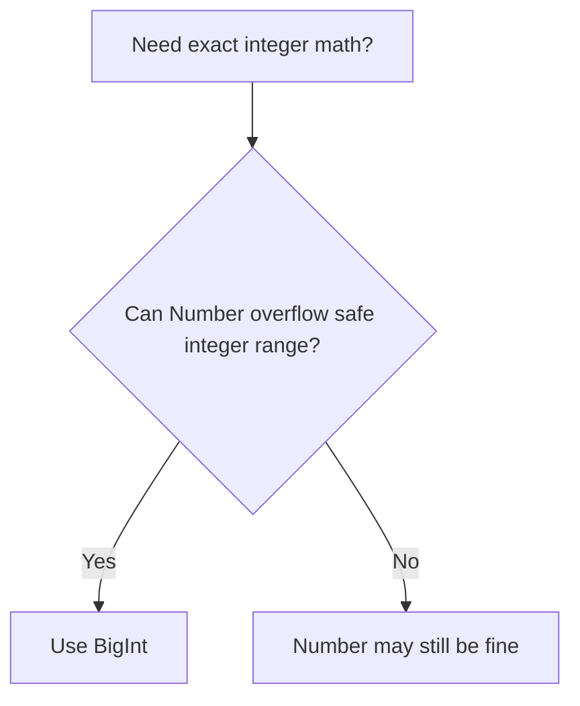
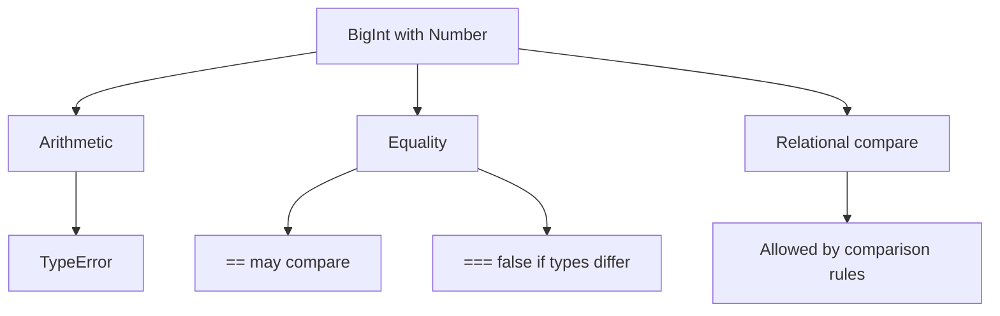
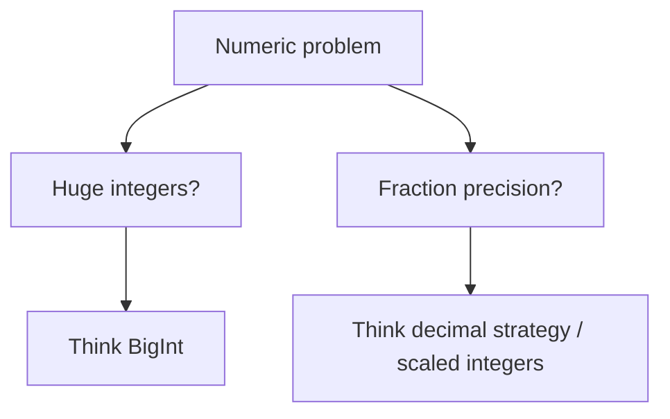

# 03. BigInt & Precision Issues

`Number` у JavaScript — це IEEE-754 double precision float. Це означає дві речі: він добре працює для більшості бізнес-чисел, але має обмеження і для дробів, і для великих цілих значень.

---

## I. Safe Integers and Precision Boundary

**Теза:** Не кожне ціле число можна безпечно зберігати у `Number`. Після `Number.MAX_SAFE_INTEGER` ви втрачаєте гарантію точної integer identity.

### Приклад
```javascript
Number.MAX_SAFE_INTEGER; // 9007199254740991

Number.MAX_SAFE_INTEGER + 1 === Number.MAX_SAFE_INTEGER + 2; // true
```

### Просте пояснення
Після певної межі `Number` вже не може відрізнити сусідні цілі числа. Значення ще "виглядає великим числом", але перестає бути надійним для id, лічильників і фінансових інваріантів.

### Технічне пояснення
Безпечний integer range обмежений 53 бітами точності мантиси. Саме тому `2^53 - 1` — останнє ціле число, яке гарантовано зберігає точну одиничну різницю між сусідніми значеннями.

### Візуалізація


> [!TIP]
> **[▶ Запустити інтерактивний візуалізатор (Number Precision Boundary vs BigInt)](../../visualisation/type-system/03-bigint-and-precision-issues/precision-boundary/index.html)**

### Edge Cases / Підводні камені
> [!WARNING]
> Якщо ваші integer IDs, sequence numbers або криптографічні/фінансові лічильники можуть вийти за межу safe integers, `Number` більше не є безпечним типом.

---

## II. What `BigInt` Fixes

**Теза:** `BigInt` дає точну арифметику для довільно великих цілих чисел, але не для дробів.

### Приклад
```javascript
9007199254740993n === 9007199254740993n; // true
2n ** 100n; // дуже велике точне ціле
```

### Просте пояснення
`BigInt` вирішує проблему "великих цілих", а не проблему всіх чисел узагалі. Якщо вам потрібні дроби з високою точністю, `BigInt` сам по собі цього не дає.

### Технічне пояснення
`BigInt` — окремий primitive type. Він не змішується неявно з `Number`, бо це могло б знову привести до тих самих precision ambiguities, які цей тип і створений прибрати.

### Візуалізація


### Edge Cases / Підводні камені
```javascript
1n / 2n; // 0n
```

Ділення `BigInt` залишається integer division. Якщо вам потрібна дробова частина, модель задачі вже не про `BigInt` alone.

---

## III. `Number` and `BigInt` Interop

**Теза:** `Number` і `BigInt` не змішуються автоматично в арифметиці. Це навмисне обмеження мови.

### Приклад
```javascript
1n + 1;        // TypeError
1n < 2;        // true
1n == 1;       // true
1n === 1;      // false
```

### Просте пояснення
JavaScript дозволяє вам порівнювати `BigInt` і `Number` в окремих випадках, але не дозволяє робити вигляд, що це один і той самий numeric world.

### Технічне пояснення
- Арифметичне змішування `BigInt` і `Number` дає `TypeError`.
- `===` враховує різні типи, тож `1n === 1` це `false`.
- `==` має окрему гілку для `Number` / `BigInt`.
- Реляційні оператори `<`, `>`, `<=`, `>=` теж мають окремі правила для змішаних numeric comparisons.

### Візуалізація


### Edge Cases / Підводні камені
> [!CAUTION]
> Явні конверсії між `BigInt` і `Number` безпечні лише тоді, коли ви точно контролюєте діапазон значень. Інакше ви або отримаєте втрату точності, або виняток.

---

## IV. Floating-Point Problems Are Separate

**Теза:** `BigInt` не лікує класичну проблему `0.1 + 0.2 !== 0.3`, бо це вже історія про floating-point, а не про великі цілі.

### Приклад
```javascript
0.1 + 0.2; // 0.30000000000000004
```

### Просте пояснення
Є дві різні числові проблеми:

1. **Великі цілі:** тут допомагає `BigInt`.
2. **Дробова точність:** тут потрібна інша модель, наприклад integer minor units або decimal library.

### Технічне пояснення
`BigInt` не представляє дробові значення. Тому він не є загальною заміною `Number`, а лише окремим інструментом для integer domain.

### Візуалізація


### Edge Cases / Підводні камені
> [!IMPORTANT]
> Якщо ви бачите фінансовий код і механічно замінюєте все на `BigInt`, ви можете лише перемістити проблему, а не вирішити її.

---

## V. Common Misconceptions

> [!IMPORTANT]
> `BigInt` не є "точнішим Number". Це окремий integer type з окремими правилами.

> [!IMPORTANT]
> `BigInt` не призначений для звичайної математики з дробами.

> [!IMPORTANT]
> Проблема safe integers і проблема floating-point decimals — це різні класи багів.

---

## VI. When This Matters / When It Doesn't

- **Важливо:** великі IDs, counters, timestamps beyond safe range, crypto, bigint-based protocols, integer-heavy parsing.
- **Менш важливо:** звичайні UI-лічильники, невеликі бізнес-числа, короткі range-обчислення всередині safe integer boundary.

---

## VII. Self-Check Questions

1. Чому `Number.MAX_SAFE_INTEGER + 1 === Number.MAX_SAFE_INTEGER + 2` може дати `true`?
2. Яку саме проблему вирішує `BigInt`, а яку не вирішує?
3. Чому `1n + 1` кидає `TypeError`, але `1n < 2` дозволено?
4. Чому `1n === 1` це `false`, а `1n == 1` може бути `true`?
5. Чим safe integer boundary відрізняється від проблеми `0.1 + 0.2`?
6. Коли явне перетворення `BigInt -> Number` стає небезпечним?
7. Чому `1n / 2n` повертає `0n`, а не `0.5n`?
8. У якій доменній моделі ви б обрали `BigInt` для id або sequence number?
9. Чому `BigInt` не можна називати "decimal type"?
10. Яку помилку в архітектурі може зробити команда, якщо сприйме `BigInt` як універсальний numeric fix?

---

## VIII. Short Answers / Hints

1. Бо після safe integer boundary сусідні integer values можуть зливатися в одну й ту саму `Number` репрезентацію.
2. Точні великі цілі; не decimal fractions і не всі numeric problems.
3. Арифметичне змішування заборонене, а реляційне порівняння має окремі правила.
4. `===` бачить різні типи, а `==` має спеціальну comparison-гілку.
5. Перше — про великі цілі, друге — про floating-point дроби.
6. Коли значення вже може вийти за safe range і втратить точність.
7. Бо `BigInt` arithmetic залишається integer-only.
8. Там, де критична точна identity великих цілих: ids, counters, sequence numbers, protocol integers.
9. Бо `BigInt` не представляє дробову частину.
10. Вона може замінити числовий тип, не розділивши integer precision problems і decimal precision problems.
