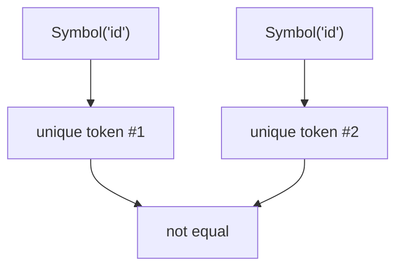
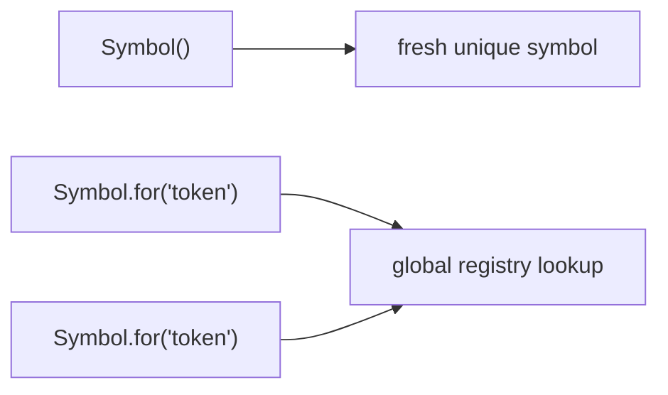
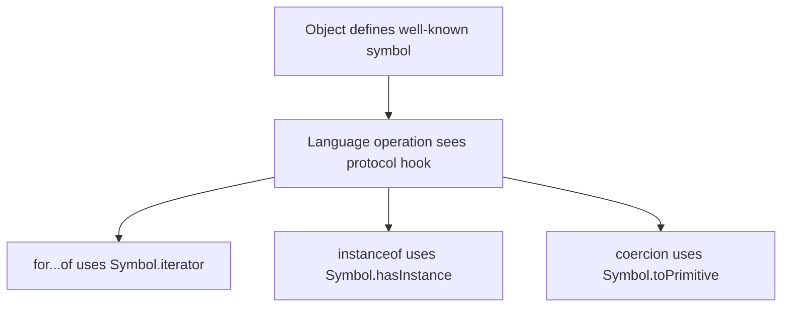
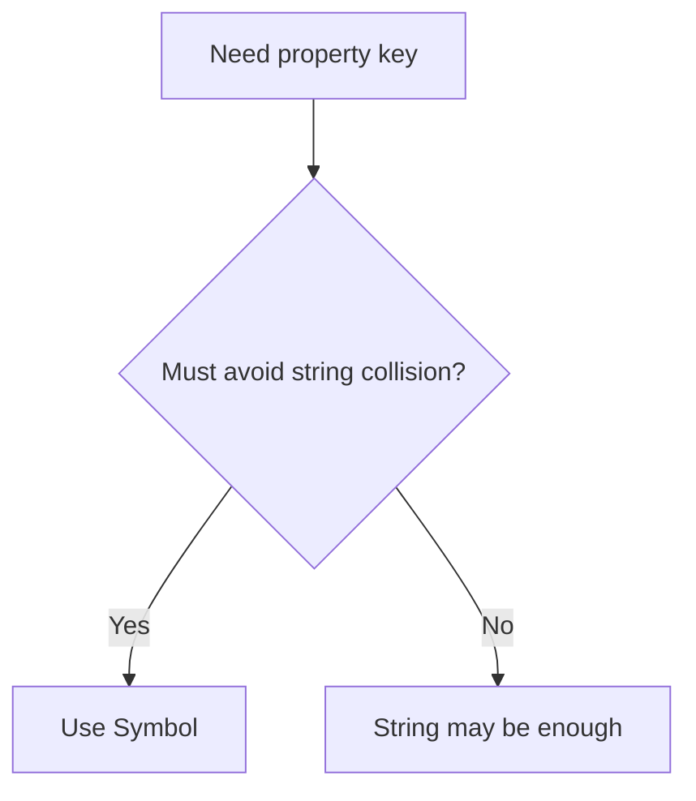

# 04. Symbols & Well-Known Symbols

`Symbol` — це primitive type для унікальних значень. На практиці він важливий не лише як "унікальний ключ", а й як механізм протоколів мови через well-known symbols.

---

## I. Symbol as Unique Key

**Теза:** `Symbol()` створює унікальне значення, яке не конфліктує з рядковими ключами й іншими symbol values.

### Приклад
```javascript
const id = Symbol("id");

const user = {
  name: "Ada",
  [id]: 42
};
```

### Просте пояснення
Якщо рядковий ключ може випадково збігтися з іншим рядком, `Symbol` створений саме для того, щоб такого збігу не було.

### Технічне пояснення
`Symbol` — primitive type. Кожен виклик `Symbol("id")` створює нове унікальне значення, навіть якщо опис однаковий. Опис потрібен лише для дебагу, а не для identity.

### Візуалізація


### Edge Cases / Підводні камені
```javascript
Symbol("id") === Symbol("id"); // false
```

Опис не робить symbols однаковими.

---

## II. Local Symbols vs Global Registry

**Теза:** `Symbol()` і `Symbol.for()` вирішують різні задачі: локальна унікальність проти shared registry identity.

### Приклад
```javascript
const a = Symbol("token");
const b = Symbol("token");

const c = Symbol.for("token");
const d = Symbol.for("token");
```

### Просте пояснення
- `Symbol()` каже: "створи мені новий унікальний ключ".
- `Symbol.for()` каже: "дай мені спільний ключ із глобального реєстру за цим ім'ям".

### Технічне пояснення
`Symbol.for(key)` працює через global symbol registry. Це не "звичайна мапа в userland", а механізм мови для повторного отримання одного й того самого symbol value по рядковому ключу.

### Візуалізація


### Edge Cases / Підводні камені
> [!CAUTION]
> `Symbol.for()` не підходить, якщо вам потрібна гарантовано локальна та невидима identity. Він підходить саме для shared protocol key.

---

## III. Well-Known Symbols

**Теза:** Well-known symbols дозволяють object-ам інтегруватись у вбудовані протоколи мови: iteration, coercion, `instanceof`, string tagging та інші.

### Приклад
```javascript
class Range {
  *[Symbol.iterator]() {
    yield 1;
    yield 2;
    yield 3;
  }
}

class Even {
  static [Symbol.hasInstance](value) {
    return typeof value === "number" && value % 2 === 0;
  }
}
```

### Просте пояснення
Well-known symbol — це не просто ключ. Це "точка підключення" до конкретної поведінки самої мови.

### Технічне пояснення
- `Symbol.iterator` визначає iterable protocol.
- `Symbol.toPrimitive` дозволяє контролювати coercion.
- `Symbol.hasInstance` перехоплює поведінку `instanceof`.
- `Symbol.toStringTag` впливає на тег у `Object.prototype.toString.call(value)`.

### Візуалізація


> [!TIP]
> **[▶ Запустити інтерактивний візуалізатор (Well-Known Symbols in Action)](../../visualisation/type-system/04-symbols-and-well-known-symbols/well-known-symbols/index.html)**

> [!TIP]
> **[▶ Запустити інтерактивний візуалізатор (Iterator Protocol Walkthrough)](../../visualisation/type-system/04-symbols-and-well-known-symbols/iterator-protocol/index.html)**

### Edge Cases / Підводні камені

#### `Symbol.toPrimitive`
```javascript
const money = {
  [Symbol.toPrimitive](hint) {
    return hint === "string" ? "$10" : 10;
  }
};
```

Цей symbol прямо втручається в coercion protocol і пов'язує цю тему з попереднім розділом про `ToPrimitive`.

#### `Symbol.toStringTag`
```javascript
const obj = {
  get [Symbol.toStringTag]() {
    return "MagicBox";
  }
};

Object.prototype.toString.call(obj); // "[object MagicBox]"
```

---

## IV. Symbols in Real Code

**Теза:** Найкращі сценарії для `Symbol` — library internals, metadata keys, протоколи, iteration hooks і уникнення accidental property collisions.

### Приклад
```javascript
const INTERNAL = Symbol("internal");

function attachMetadata(node, value) {
  node[INTERNAL] = value;
}
```

### Просте пояснення
`Symbol` корисний там, де звичайний рядковий ключ занадто "відкритий" і може бути випадково перезаписаний або використаний стороннім кодом.

### Технічне пояснення
Symbol-keyed properties не конфліктують зі string-keyed properties і не проходять через звичайні string-based enumeration paths, хоча їх усе ще можна отримати явно через `Object.getOwnPropertySymbols`.

### Візуалізація


### Edge Cases / Підводні камені
> [!WARNING]
> `Symbol` не є security boundary. Якщо хтось має доступ до об'єкта, symbol-keyed properties усе одно можна знайти через рефлексію.

---

## V. Common Misconceptions

> [!IMPORTANT]
> `Symbol` не робить поле приватним. Він лише робить ключ не-рядковим і унікальним.

> [!IMPORTANT]
> `Symbol("x")` і `Symbol("x")` — різні значення. Опис не є identity.

> [!IMPORTANT]
> Well-known symbols — це не "дивні константи", а офіційні hooks для language protocols.

---

## VI. When This Matters / When It Doesn't

- **Важливо:** library code, iteration protocols, custom coercion, advanced metaprogramming, avoiding key collisions in shared objects.
- **Менш важливо:** прості CRUD-об'єкти, звичайні DTO, короткі навчальні приклади без протоколів і library internals.

---

## VII. Self-Check Questions

1. Чому `Symbol("id") === Symbol("id")` дає `false`?
2. У чому різниця між `Symbol()` і `Symbol.for()`?
3. Чому `Symbol` підходить для internal metadata keys краще, ніж string?
4. Який well-known symbol задіює `for...of`?
5. Як `Symbol.hasInstance` змінює поведінку `instanceof`?
6. Чому `Symbol.toPrimitive` логічно пов'язаний із темою coercion?
7. Чому symbol-keyed property не є приватним полем?
8. Який ризик у надмірному використанні `Symbol.for()` у великій системі?
9. Коли `Symbol.toStringTag` справді корисний, а коли це лише cosmetic trick?
10. Як би ви пояснили senior-розробнику різницю між "унікальний ключ" і "hook в language protocol" у контексті `Symbol`?

---

## VIII. Short Answers / Hints

1. Бо кожен виклик `Symbol()` створює нову identity незалежно від опису.
2. `Symbol()` дає fresh symbol, `Symbol.for()` працює через global registry.
3. Бо уникає випадкових string-collisions у shared objects.
4. `Symbol.iterator`.
5. Він дозволяє перевизначити semantics оператора `instanceof`.
6. Бо це language hook для custom primitive conversion.
7. Його можна знайти через reflection; це не private field.
8. Shared registry identity може почати текти між модулями й створювати неочевидні залежності.
9. Коли треба інтегруватися з introspection/debug output; не коли це лише декор без практичної цінності.
10. Унікальний ключ захищає identity property name, а protocol hook змінює поведінку самої мови.
