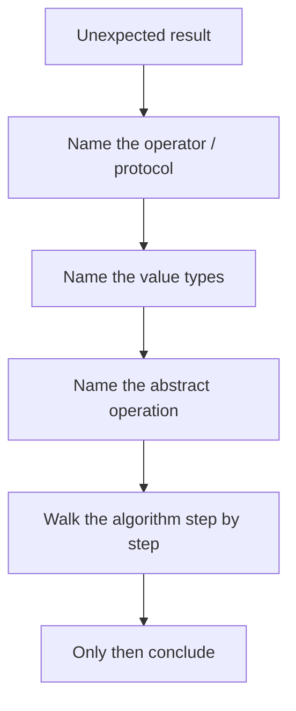

# 05. Practice Lab: Coercion Bugs & Equality Traps

Цей lab зводить увесь блок до практики. Тут важливо не просто вгадати результат виразу, а пройти той самий шлях, яким іде специфікація: equality algorithm, coercion chain, numeric model або symbol protocol.

---

## I. Як проходити цей Lab

Для кожної задачі робіть один і той самий розбір:

1. Зафіксуйте початкові типи значень.
2. Визначте, який саме алгоритм запускається: `==`, `===`, `Object.is()`, `ToPrimitive`, `ToNumber`, `ToString`, `BigInt` interop, well-known symbol protocol.
3. Пройдіть кроки алгоритму буквально.
4. Лише після цього робіть висновок про результат.

---

## II. Equality Traps

### Task 1
```javascript
"" == 0
```

**Що перевіряємо:** `String -> Number` у `Abstract Equality`.

### Task 2
```javascript
false == []
```

**Що перевіряємо:** `Boolean -> Number`, потім `Object -> Primitive`.

### Task 3
```javascript
Object.is(NaN, NaN)
```

**Що перевіряємо:** `SameValue`.

### Task 4
```javascript
[NaN].includes(NaN)
```

**Що перевіряємо:** `SameValueZero`.

### Task 5
```javascript
const a = {};
const b = {};
a === b
```

**Що перевіряємо:** reference identity.

---

## III. Coercion Traps

### Task 6
```javascript
const obj = {
  valueOf: () => 10,
  toString: () => "ten"
};

obj + ""
```

**Що перевіряємо:** `ToPrimitive(..., "default")`.

### Task 7
```javascript
`${obj}`
```

**Що перевіряємо:** string-oriented coercion path.

### Task 8
```javascript
Number("")
```

**Що перевіряємо:** `ToNumber` для порожнього рядка.

### Task 9
```javascript
"" + Symbol("id")
```

**Що перевіряємо:** symbol in implicit string coercion context.

### Task 10
```javascript
const qty = "";

if (qty == 0) {
  submitOrder();
}
```

**Що перевіряємо:** boundary bug з form-like input.

---

## IV. BigInt Traps

### Task 11
```javascript
Number.MAX_SAFE_INTEGER + 1 === Number.MAX_SAFE_INTEGER + 2
```

**Що перевіряємо:** safe integer boundary.

### Task 12
```javascript
1n + 1
```

**Що перевіряємо:** arithmetic interop between `BigInt` and `Number`.

### Task 13
```javascript
1n < 2
```

**Що перевіряємо:** relational comparison rules.

### Task 14
```javascript
1n / 2n
```

**Що перевіряємо:** integer division semantics.

---

## V. Symbol & Protocol Traps

### Task 15
```javascript
Symbol("x") === Symbol("x")
```

**Що перевіряємо:** symbol identity.

### Task 16
```javascript
Symbol.for("x") === Symbol.for("x")
```

**Що перевіряємо:** global symbol registry.

### Task 17
```javascript
class Box {
  *[Symbol.iterator]() {
    yield 1;
    yield 2;
  }
}

[...new Box()]
```

**Що перевіряємо:** iterable protocol через `Symbol.iterator`.

### Task 18
```javascript
class Even {
  static [Symbol.hasInstance](value) {
    return typeof value === "number" && value % 2 === 0;
  }
}

2 instanceof Even
```

**Що перевіряємо:** `instanceof` hook.

---

## VI. Practice Workflow

**Теза:** Якщо задача незрозуміла, проблема майже завжди не в JavaScript, а в тому, що ви ще не назвали правильний алгоритм.

### Приклад
```javascript
[] == false
```

### Просте пояснення
Замість "JS знову дивний" потрібно питати:

1. Це `==` чи `===`?
2. Які типи зліва і справа?
3. Яка наступна abstract operation?

### Технічне пояснення
Це робить ваш розбір repeatable. Саме так поводиться специфікаційне мислення: не вгадувати, а відтворювати правила.

### Візуалізація


### Edge Cases / Підводні камені
> [!WARNING]
> Найгірша звичка в цій темі — запам'ятовувати окремі "дивні приклади" без моделі. Через тиждень ви забудете приклад, але не навчитесь мислити алгоритмом.

---

## VII. Short Answers / Hints

1. `"" == 0` -> `"" -> 0`, результат `true`.
2. `false -> 0`, `[] -> "" -> 0`, результат `true`.
3. `Object.is(NaN, NaN)` -> `true`.
4. `includes` працює через `SameValueZero`, тому результат `true`.
5. Різні object references -> `false`.
6. `obj + ""` тягне `default` path і часто бере `valueOf()` першим.
7. Template literal тягне string-oriented coercion path.
8. `Number("")` -> `0`.
9. Тут буде `TypeError`.
10. Умова може спрацювати для порожнього рядка, хоча бізнес-логіка очікувала число.
11. Може дати `true` через втрату integer precision.
12. `TypeError`, бо арифметичне змішування заборонене.
13. Дозволено; результат `true`.
14. `0n`, бо це integer division.
15. `false`, бо `Symbol()` завжди створює fresh identity.
16. `true`, бо `Symbol.for()` іде через global registry.
17. `[1, 2]`, бо spread читає iterable protocol.
18. `true`, бо `instanceof` делегує в `Symbol.hasInstance`.

---

## VIII. Suggested Review

Після проходження цього lab поверніться до:

- [01 Abstract Equality vs Strict Equality](../01-abstract-vs-strict-equality/README.md)
- [02 Primitive Coercion Algorithms](../02-primitive-coercion/README.md)
- [03 BigInt & Precision Issues](../03-bigint-and-precision-issues/README.md)
- [04 Symbols & Well-Known Symbols](../04-symbols-and-well-known-symbols/README.md)

І окремо відкрийте візуалізації:

- [=== vs Object.is vs SameValueZero](../../visualisation/type-system/01-abstract-vs-strict-equality/equality-algorithms/index.html)
- [ToPrimitive: Object vs Date](../../visualisation/type-system/02-primitive-coercion/index.html)
- [Number Precision Boundary vs BigInt](../../visualisation/type-system/03-bigint-and-precision-issues/precision-boundary/index.html)
- [Well-Known Symbols in Action](../../visualisation/type-system/04-symbols-and-well-known-symbols/well-known-symbols/index.html)
- [Iterator Protocol Walkthrough](../../visualisation/type-system/04-symbols-and-well-known-symbols/iterator-protocol/index.html)
