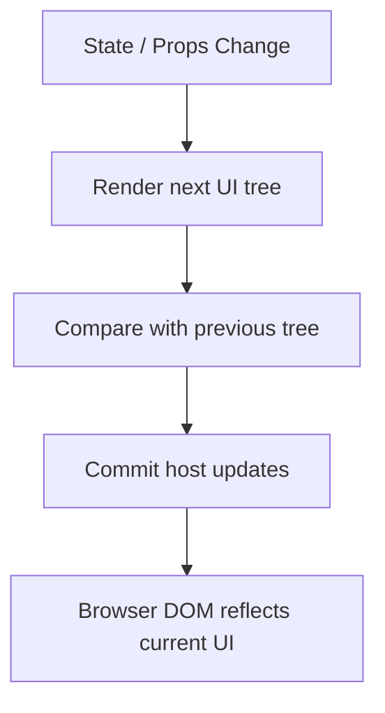

# What React Actually Is

React треба розуміти не як “бібліотеку шаблонів”, а як **runtime для побудови, оновлення і синхронізації дерева UI**. Його головна цінність не в JSX, а в тому, що він бере на себе **tree diffing, scheduling, identity і commit updates**.

---

## I. Core Mechanism

**Теза:** React приймає декларативний опис UI, будує з нього дерево елементів, обчислює наступну версію цього дерева після змін і синхронізує різницю з host environment, зазвичай DOM.

### Приклад
```jsx
function App() {
  const isLoggedIn = true;
  return isLoggedIn ? <Dashboard /> : <LoginScreen />;
}
```

### Просте пояснення
Ти не кажеш React: “створи `div`, потім видали `form`, потім встав `section`”. Ти просто описуєш, **який UI має бути зараз**. React сам вирішує, що саме треба змінити в дереві.

### Технічне пояснення
React працює як **declarative UI runtime**:

1. Компоненти повертають **React elements**.
2. React розглядає ці elements як опис цільового дерева UI.
3. Під час update він запускає render work і будує **next tree**.
4. Потім порівнює його з попереднім представленням.
5. На commit phase застосовує мінімально потрібні host updates.

Важливо: React не є DOM API. DOM лише один із host targets. Сам React оперує **component tree**, **element tree**, identity вузлів і scheduling rules.

### Visual Mental Model

> [!TIP]
> **[▶ Запустити інтерактивний React Runtime Tree](../../visualisation/mental-model-and-rendering/01-what-react-actually-is/react-runtime-tree/index.html)**



### Edge Cases / Підводні камені
- React не “оновлює весь DOM заново” на кожен state update.
- JSX не є React runtime; це лише зручний синтаксис.
- React tree і DOM tree часто схожі, але не тотожні.
- Component identity важливіша за те, як код виглядає в одному файлі.

---

## II. Common Misconceptions

> [!IMPORTANT]
> React не є просто “рендерером HTML”. Він керує **component identity, updates, effects і scheduling**.

> [!IMPORTANT]
> Declarative не означає “без логіки”. Це означає: ти описуєш **result state**, а не послідовність imperative DOM-команд.

> [!IMPORTANT]
> Reconciliation не означає “deep compare всього підряд”. React використовує власні евристики tree matching.

---

## III. When This Matters / When It Doesn't

- **Важливо:** архітектура компонентів, state placement, debugging re-renders, key/identity bugs.
- **Менш важливо:** коли ти лише пишеш дрібний статичний JSX і ще не аналізуєш update model.

---

## IV. Self-Check Questions

1. Чому React краще мислити як runtime, а не як template engine?
2. Що саме повертає component function?
3. Яка різниця між “описати UI” і “наказати DOM, що робити”?
4. Що React робить після зміни state?
5. Чому React не зводиться до JSX?
6. Що таке reconciliation mindset?
7. Чому tree identity важлива для збереження state?
8. Чи є React DOM API?
9. Що React синхронізує на commit phase?
10. Чому компонентний tree важливий окремо від реального DOM?

---

## V. Short Answers / Hints

1. Бо він керує tree lifecycle та updates.
2. React element description.
3. Declarative описує результат, imperative описує кроки.
4. Рахує next tree і commit-ить різницю.
5. JSX тільки синтаксис.
6. Мислити категоріями “який tree має бути зараз”.
7. Бо state прив'язаний до position/type у tree.
8. Ні, React DOM лише host renderer.
9. Host mutations, refs, layout-related commit work.
10. Бо саме tree компонента керує identity і reconciliation.

---

## VI. Suggested Practice

1. Візьми маленький imperative DOM-приклад і перепиши його як “стан -> декларативне дерево”.
2. Поясни для себе різницю між “оновити `<div>`” і “перерендерити subtree”.
3. Після цієї статті переходь у [02 JSX as Syntax Over Element Objects](../02-jsx-as-syntax-over-element-objects/README.md), щоб побачити, з чого саме починається декларативний опис.
