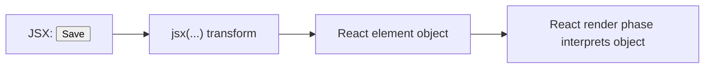

# JSX as Syntax Over Element Objects

JSX часто сприймають як “HTML всередині JavaScript”, але це неточна модель. Насправді JSX компілюється у виклики React runtime, які створюють **immutable element objects**.

---

## I. Core Mechanism

**Теза:** JSX не створює DOM і не викликає компонент самостійно. Він лише генерує **опис вузла** у вигляді React element object, який React потім використовує під час render phase.

### Приклад
```jsx
function App() {
  return <Button kind="primary">Save</Button>;
}
```

Приблизно після трансформації:

```javascript
function App() {
  return jsx(Button, { kind: "primary", children: "Save" });
}
```

### Просте пояснення
JSX схожий на HTML, але це не HTML. Це зручний спосіб написати: “створи element object типу `Button` з такими props”.

### Технічне пояснення
Сучасний JSX transform генерує виклики на кшталт `jsx(...)` / `jsxs(...)`; legacy path працював через `React.createElement(...)`. У будь-якому випадку результатом є **React element object** з полями на зразок:

- `type`
- `props`
- `key`
- `ref` (спеціальний канал, не звичайний prop)

Цей object:

- не є DOM node;
- не є component instance;
- зазвичай трактується як immutable description;
- використовується React для побудови дерева render work.

### Visual Mental Model

> [!TIP]
> **[▶ Запустити інтерактивний JSX to Element Object](../../visualisation/mental-model-and-rendering/02-jsx-as-syntax-over-element-objects/jsx-to-element-object/index.html)**



### Edge Cases / Підводні камені
- `<div />` у JSX теж створює element object, а не DOM node прямо зараз.
- `key` і `ref` не поводяться як звичайні props.
- Зміна element object руками не є нормальною React-моделлю.
- Умовний JSX усе одно зводиться до звичайних JS expressions.

---

## II. Common Misconceptions

> [!IMPORTANT]
> JSX не є template language окремо від JavaScript. Це синтаксичний цукор, що перетворюється на виклики функцій.

> [!IMPORTANT]
> Element object не “живе” в DOM. Це лише опис того, що React хоче побачити в host tree.

> [!IMPORTANT]
> JSX не викликає компонент напряму. React викликає компонент пізніше під час render orchestration.

---

## III. When This Matters / When It Doesn't

- **Важливо:** розуміння `key`, `ref`, conditional rendering, children, why JSX is not DOM.
- **Менш важливо:** якщо ти просто пишеш прості компоненти і ще не чіпаєш reconciliation bugs.

---

## IV. Self-Check Questions

1. Що таке JSX на рівні механіки?
2. Чим JSX відрізняється від HTML?
3. Що повертає JSX expression?
4. Чи створює JSX DOM node одразу?
5. Які поля концептуально є в React element object?
6. Чому `key` не читається як звичайний prop?
7. Хто реально викликає component function: JSX чи React?
8. Що спільного між `<div />` і `<Button />` на рівні element description?
9. Чому не варто мислити JSX як template string?
10. Яка роль JSX transform у pipeline?

---

## V. Short Answers / Hints

1. Синтаксис над element creation.
2. HTML парсить браузер, JSX компілює toolchain.
3. React element object.
4. Ні.
5. `type`, `props`, `key`, `ref`.
6. Бо це спеціальне поле для reconciliation.
7. React.
8. Обидва стають element objects з різним `type`.
9. Бо це частина JS AST і runtime contract.
10. Перетворює JSX у runtime calls.

---

## VI. Suggested Practice

1. Вручну перепиши 5 JSX-прикладів у приблизний `jsx(...)` / `createElement(...)` вигляд.
2. Знайди в коді місця, де ти плутав “JSX node” і “DOM node”.
3. Після цієї статті переходь у [03 React Elements vs Components vs DOM Nodes](../03-react-elements-vs-components-vs-dom-nodes/README.md), щоб розвести рівні абстракції остаточно.
