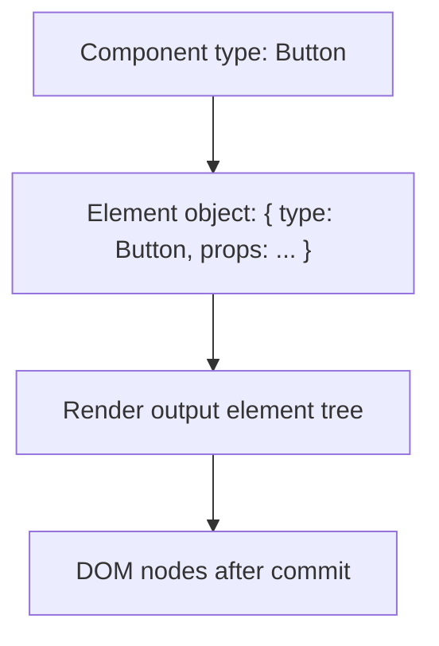

# React Elements vs Components vs DOM Nodes

Одна з головних React-помилок у голові: люди змішують **element**, **component** і **DOM node** в одну сутність. Насправді це три різні рівні однієї системи, і кожен живе на своєму етапі pipeline.

---

## I. Core Mechanism

**Теза:** Component function створює **element descriptions**, а React уже на їхній основі підтримує host instances, наприклад DOM nodes. Компонент не є DOM node, а element не є живим інстансом.

### Приклад
```jsx
function Toolbar() {
  return (
    <section>
      <Button />
    </section>
  );
}
```

### Просте пояснення
- **Component**: функція з логікою.
- **Element**: об'єкт-опис результату.
- **DOM node**: реальний вузол у браузері після commit.

### Технічне пояснення
Рівні потрібно розділяти так:

| Рівень | Що це | Хто створює |
| :--- | :--- | :--- |
| **Component** | Функція або class type, яку React може викликати | Розробник |
| **React element** | Immutable object description (`type`, `props`, `key`) | JSX transform / React runtime |
| **DOM node** | Host instance у браузері | React DOM на commit phase |

При `<Button />`:

1. JSX створює element object із `type = Button`.
2. React під час render викликає `Button`.
3. `Button` повертає інші element objects.
4. React DOM під час commit створює/оновлює реальні host nodes.

### Visual Mental Model

> [!TIP]
> **[▶ Запустити інтерактивний React vs DOM Layers](../../visualisation/mental-model-and-rendering/03-react-elements-vs-components-vs-dom-nodes/react-vs-dom-layers/index.html)**



### Edge Cases / Підводні камені
- `ref` на DOM element і `ref` на component мають різні semantics.
- Якщо компонент повертає `null`, компонент був, element logic була, а DOM node може не з'явитися.
- Один component type може породжувати різні host structures залежно від props.
- Element object існує до commit; DOM node з'являється лише після host mutations.

---

## II. Common Misconceptions

> [!IMPORTANT]
> Компонент не є “екземпляром DOM”. Він може взагалі не мати власного DOM wrapper.

> [!IMPORTANT]
> React element не є “virtual DOM node” у простому сенсі “майже як DOM”. Це декларативний descriptor.

> [!IMPORTANT]
> DOM node не зберігає React state. State прив'язаний до component identity в React tree.

---

## III. When This Matters / When It Doesn't

- **Важливо:** refs, debugging, memoization, reconciliation, conditional wrappers, `key`.
- **Менш важливо:** коли ти ще не виходиш за межі простих leaf components.

---

## IV. Self-Check Questions

1. Чим component type відрізняється від element object?
2. Коли з'являється DOM node?
3. Чи є `<Button />` викликом функції `Button` прямо в JSX?
4. Хто створює host nodes?
5. Чи може компонент існувати без власного DOM element?
6. Чому element object не можна плутати з “instance”?
7. Де живе state: у DOM node чи в React tree?
8. Що відбувається між поверненням element object і появою DOM node?
9. Чому `null` return не означає, що компонента “не було”?
10. Для чого корисно тримати ці три рівні окремо в голові?

---

## V. Short Answers / Hints

1. Type проти description object.
2. На commit phase.
3. Ні.
4. React DOM renderer.
5. Так.
6. Бо він лише опис.
7. У React state slots, прив'язаних до tree position.
8. Render work і reconciliation.
9. Бо render все одно відбувся.
10. Щоб не плутати identity, refs і update semantics.

---

## VI. Suggested Practice

1. Для 5 компонентів у своєму проєкті опиши окремо: component, returned elements, final DOM.
2. Знайди приклад компонента, який повертає fragment або `null`, і поясни, чому це руйнує модель “1 component = 1 DOM node”.
3. Після цієї статті переходь у [04 Components and Hooks Must Be Pure](../04-components-and-hooks-must-be-pure/README.md), бо після рівнів абстракції треба зрозуміти головне правило render phase.
