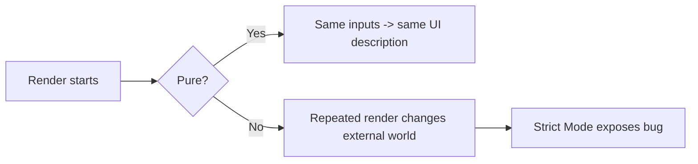

# Components and Hooks Must Be Pure

React може безпечно перезапускати render лише за однієї умови: render logic має бути **pure and idempotent**. Саме тому side effects у body компонента або mutation shared values під час render ламають модель React.

---

## I. Core Mechanism

**Теза:** Component і Hook повинні поводитися як чисті обчислення від своїх входів. За однакових `props`, `state` і `context` render має повертати однаковий результат і не спричиняти side effects поза собою.

### Приклад
```jsx
function Clock({ now }) {
  return <h1>{now.toLocaleTimeString()}</h1>;
}
```

Проблемний приклад:

```jsx
let nextId = 0;

function Row() {
  nextId++;
  return <div>{nextId}</div>;
}
```

### Просте пояснення
React хоче мати можливість:

- викликати render повторно;
- перервати render;
- порівнювати різні версії UI;
- у development перевіряти код подвійними викликами.

Якщо під час render ти мутуєш зовнішній світ, ці повторні виклики дають баги.

### Технічне пояснення
Purity в React практично означає:

1. **No side effects during render**.
2. **No mutation of non-local values**.
3. **Idempotent output for same inputs**.

Render phase може бути повторно виконана, перервана або відкинута. Тому render logic має бути лише обчисленням next UI description. Взаємодія з DOM, network, timers, subscriptions або mutable singleton state має йти через event handlers чи effects.

### Visual Mental Model

> [!TIP]
> **[▶ Запустити інтерактивний Purity vs Side Effects](../../visualisation/mental-model-and-rendering/04-components-and-hooks-must-be-pure/purity-vs-side-effects/index.html)**



### Edge Cases / Підводні камені
- `Math.random()` або `new Date()` прямо в render роблять output нестабільним.
- Mutation module-level arrays/objects під час render ламає idempotency.
- Reading mutable ref допустимо не завжди; писати в `ref.current` під час render зазвичай smell.
- Локальна mutation тимчасових значень усередині render окей, якщо вона не тече назовні.

---

## II. Common Misconceptions

> [!IMPORTANT]
> Pure не означає “без жодних функцій виклику”. Це означає “без observable side effects і з idempotent output”.

> [!IMPORTANT]
> Event handler не є частиною render phase, тому side effects там допустимі.

> [!IMPORTANT]
> `useEffect` існує не для “будь-якої логіки”, а для синхронізації з зовнішнім світом після commit.

---

## III. When This Matters / When It Doesn't

- **Важливо:** Strict Mode, concurrency, testability, predictable rendering, avoiding duplicate network/DOM work.
- **Менш важливо:** лише в мікроскопічних статичних demo, де render не повторюється помітно, але навіть там це все одно правило.

---

## IV. Self-Check Questions

1. Що означає purity у React-контексті?
2. Чому React вимагає idempotent render?
3. Чому side effects у body компонента небезпечні?
4. Чим local temporary mutation відрізняється від mutation shared value?
5. Чому `new Date()` в render може бути проблемою?
6. Чи можна робити network request у render?
7. Де мають жити side effects?
8. Чому Strict Mode особливо добре ловить impurity?
9. Чи завжди читання `ref.current` у render безпечне?
10. Що означає “same inputs -> same output” для компонента?

---

## V. Short Answers / Hints

1. Render без side effects і з передбачуваним output.
2. Бо React може rerender/replay/interleave work.
3. Бо повторний render дублює або спотворює side effect.
4. Local mutation не виходить назовні, shared mutation змінює external state.
5. Бо значення нестабільне між render calls.
6. Ні.
7. В event handlers або effects.
8. Бо навмисно повторює dev-only шляхи.
9. Не завжди; записувати тим більше не варто.
10. Однакові `props/state/context` дають однаковий UI description.

---

## VI. Suggested Practice

1. Знайди 10 прикладів логіки у своїх компонентах і розділи їх на: pure render, event logic, effect logic.
2. Візьми компонент з `Date.now()` або `Math.random()` у body і винеси нестабільність у правильне місце.
3. Після цієї статті переходь у [05 Render Phase vs Commit Phase](../05-render-phase-vs-commit-phase/README.md), бо саме там стає зрозуміло, чому purity така важлива.
