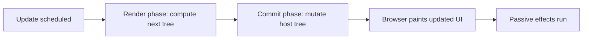

# Render Phase vs Commit Phase

Більшість React-непорозумінь виникає через змішування двох етапів: **render phase** і **commit phase**. React спочатку рахує, **що має змінитися**, і лише потім застосовує зміни до host environment.

---

## I. Core Mechanism

**Теза:** Render phase обчислює next UI tree і не має чіпати зовнішній світ. Commit phase застосовує результат: робить DOM mutations, оновлює refs, запускає layout work і готує passive effects.

### Приклад
```jsx
function Counter({ count }) {
  return <span>{count}</span>;
}
```

### Просте пояснення
- **Render**: React думає.
- **Commit**: React діє.

Поки триває render, DOM може ще бути старим. Лише після commit користувач бачить оновлення.

### Технічне пояснення
На високому рівні pipeline такий:

1. Trigger update.
2. React заходить у render work і викликає компоненти.
3. Створює next element/output tree.
4. Визначає, що потрібно змінити.
5. На commit застосовує host mutations.
6. Оновлює refs.
7. Після commit синхронні layout-related hooks уже бачать новий DOM.
8. Passive effects (`useEffect`) ідуть після paint-oriented scheduling.

Ключове правило: **render may be repeated; commit is the moment side effects become real**.

### Visual Mental Model

> [!TIP]
> **[▶ Запустити інтерактивний Render vs Commit Timeline](../../visualisation/mental-model-and-rendering/05-render-phase-vs-commit-phase/render-commit-timeline/index.html)**



### Edge Cases / Підводні камені
- `console.log` у render може статися навіть якщо користувач не побачить результат цього render.
- DOM refs не гарантують новий DOM до commit.
- `useLayoutEffect` і `useEffect` працюють у різні моменти після commit.
- Interrupted/discarded render може ніколи не дійти до commit.

---

## II. Common Misconceptions

> [!IMPORTANT]
> “Компонент відрендерився” не завжди означає “DOM уже оновився”.

> [!IMPORTANT]
> Render не дорівнює paint. Між ними ще є commit і політика браузера.

> [!IMPORTANT]
> Якщо render phase відбулася двічі, це не означає, що DOM двічі мутувався.

---

## III. When This Matters / When It Doesn't

- **Важливо:** effects, refs, DOM measurements, performance debugging, Strict Mode.
- **Менш важливо:** коли ти не працюєш з DOM timing і не дебажиш repeated renders.

---

## IV. Self-Check Questions

1. Що відбувається на render phase?
2. Що відбувається на commit phase?
3. Чому render має бути pure?
4. Коли DOM реально оновлюється?
5. Чому render може статися без commit?
6. Чому `useEffect` не є render logic?
7. Чим layout work концептуально відрізняється від passive effects?
8. Чи означає два renders два DOM updates?
9. Чому DOM measurement у render некоректне місце?
10. Який зв'язок між render/commit і concurrency?

---

## V. Short Answers / Hints

1. Обчислення next tree.
2. Реальні host updates.
3. Бо render replayable.
4. На commit.
5. Бо work може бути скасована або перерахована.
6. Бо effect синхронізує external system після commit.
7. Layout work бачить DOM до paint, passive effects пізніше.
8. Ні.
9. Бо DOM може бути ще старим або незафіксованим.
10. Concurrency підсилює розділення “compute” і “apply”.

---

## VI. Suggested Practice

1. Для кожного рядка логіки в компоненті познач: render, event, commit-adjacent effect.
2. Напиши маленький demo з `console.log` у render, `useLayoutEffect`, `useEffect` і поясни порядок.
3. Після цієї статті переходь у [06 React Calls Components and Hooks](../06-react-calls-components-and-hooks/README.md), щоб побачити, чому саме React мусить контролювати render orchestration.
