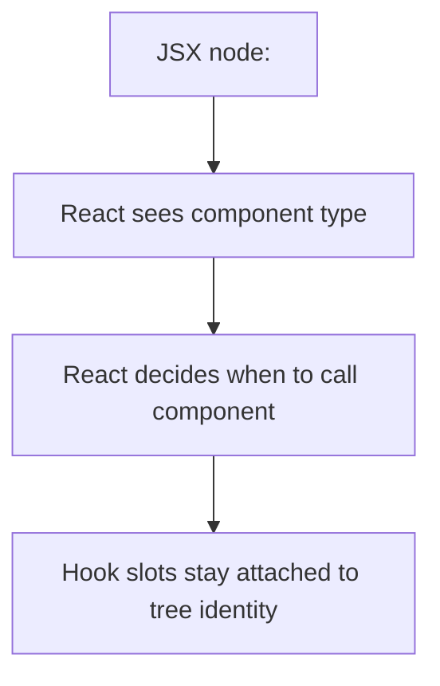

# React Calls Components and Hooks

У React компонент не повинен викликатися як звичайна функція вручну. Це не стилістичне побажання, а структурне правило: **саме React має контролювати, коли і в якому контексті викликати компонент і Hooks**.

---

## I. Core Mechanism

**Теза:** Коли React сам викликає component functions і Hooks, він може прив'язати state до tree identity, коректно виконувати reconciliation, застосовувати scheduling і перевіряти Rules of Hooks.

### Приклад
```jsx
function Article() {
  return <p>Post</p>;
}

function Page() {
  return <Layout><Article /></Layout>;
}
```

Поганий патерн:

```jsx
function Page() {
  return <Layout>{Article()}</Layout>;
}
```

### Просте пояснення
`<Article />` говорить React: “ось окремий компонентний вузол дерева”.  
`Article()` каже: “просто виконай цю функцію зараз”, минаючи React-модель identity.

### Технічне пояснення
Офіційна React-модель прямо вимагає: **components should only be used in JSX; React should call them**. Це дає React такі властивості:

- state прив'язується до component identity у tree;
- component types беруть участь у reconciliation;
- React може оптимізувати render scheduling;
- DevTools можуть відобразити tree коректно;
- Rules of Hooks не руйнуються випадковим direct call.

Hooks також не можна передавати як звичайні значення або динамічно підміняти. Вони є частиною структурованого render contract, а не просто callback API.

### Visual Mental Model

> [!TIP]
> **[▶ Запустити інтерактивний React Call Orchestrator](../../visualisation/mental-model-and-rendering/06-react-calls-components-and-hooks/react-call-orchestrator/index.html)**



### Edge Cases / Підводні камені
- Directly calling a component може “працювати” на простих прикладах, але ламає model guarantees.
- Компонент без Hooks теж не варто викликати вручну: ти губиш tree semantics.
- Hook factories і dynamic hook passing ускладнюють local reasoning.
- Мапінг `items.map(Item)` теж може бути пасткою, якщо `Item` є component з Hooks і викликається не як JSX.

---

## II. Common Misconceptions

> [!IMPORTANT]
> “Компонент це ж просто функція” технічно частково правда, але в React цього недостатньо. Component type має спеціальне значення для runtime.

> [!IMPORTANT]
> Якщо direct call “не впав”, це ще не означає, що він коректний.

> [!IMPORTANT]
> Hook теж не є “звичайною утилітарною функцією”, яку можна передавати і викликати де завгодно.

---

## III. When This Matters / When It Doesn't

- **Важливо:** state identity, reconciliation, hook correctness, debugging, component architecture.
- **Менш важливо:** майже ніколи; це базове structural правило React.

---

## IV. Self-Check Questions

1. Чому `<Article />` і `Article()` не еквівалентні?
2. Хто повинен викликати component functions?
3. Що React втрачає при direct component call?
4. Як це пов'язано з Hooks?
5. Чому component type важливий для reconciliation?
6. Чому Hooks не можна передавати як regular values?
7. Що таке local reasoning у контексті Hooks?
8. Чому direct call шкодить DevTools model?
9. Чому навіть без Hooks direct call лишається поганою моделлю?
10. Як React orchestration допомагає scheduling?

---

## V. Short Answers / Hints

1. JSX створює tree boundary, direct call ні.
2. React.
3. Identity, reconciliation semantics, hook guarantees.
4. Hook slots прив'язані до render contract.
5. Бо React матчить дерево за типами і позицією.
6. Бо вони мають бути статичними за місцем виклику.
7. Можна зрозуміти hook behavior, дивлячись на сам компонент.
8. Tree стає непрозорим для інструментів.
9. Бо губиться структура component tree.
10. React сам керує порядком і моментом викликів.

---

## VI. Suggested Practice

1. Перевір у своєму коді всі місця, де компонент може викликатися як функція, і заміни їх на JSX.
2. Знайди випадки, де Hook передається як аргумент або prop, і поясни, чому це smell.
3. Після цієї статті переходь у [07 Snapshot Model of a Render](../07-snapshot-model-of-a-render/README.md), бо саме там стає видно, як React прив'язує дані до конкретного render call.
