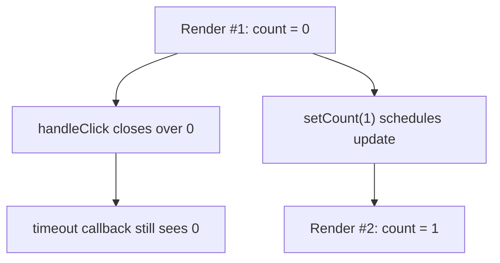

# Snapshot Model of a Render

Кожен render у React треба мислити як **окремий знімок даних у часі**. Усередині конкретного render `props`, `state` і `context` фіксовані. Саме звідси виникають і сила React-моделі, і типові stale closure bugs.

---

## I. Core Mechanism

**Теза:** Кожен render бачить власний snapshot значень. Event handlers, closures і JSX, створені в цьому render, замкнені саме на цих значеннях, а не автоматично “оновлюються магічно”.

### Приклад
```jsx
function Counter() {
  const [count, setCount] = useState(0);

  function handleClick() {
    setTimeout(() => {
      console.log(count);
    }, 1000);
  }

  return <button onClick={handleClick}>{count}</button>;
}
```

### Просте пояснення
Якщо `handleClick` був створений у render, де `count === 0`, то callback усередині нього теж пам'ятає `0`, навіть якщо пізніше UI уже показує `3`.

### Технічне пояснення
React не мутує “поточний render object”. Натомість кожен render:

- отримує власні `props/state/context`;
- обчислює власний output;
- створює closures, прив'язані до цих значень.

Тому:

- `setState` не змінює локальну змінну `count` у вже поточному render;
- новий state буде видимий лише в **наступному render snapshot**;
- asynchronous callbacks часто закриваються на старі значення.

Це не баг React. Це прямий наслідок того, що render є **pure snapshot computation**.

### Visual Mental Model

> [!TIP]
> **[▶ Запустити інтерактивний Render Snapshot Board](../../visualisation/mental-model-and-rendering/07-snapshot-model-of-a-render/render-snapshot-board/index.html)**



### Edge Cases / Підводні камені
- `setCount(count + 1)` тричі підряд у одному handler не означає “+3” без functional update.
- Async callbacks, intervals і subscriptions часто страждають від stale values.
- Ref можна використати як mutable cell, але це інша модель, не render snapshot.
- Context теж snapshot-based: consumer читає те значення, яке діє для конкретного render.

---

## II. Common Misconceptions

> [!IMPORTANT]
> `setState` не мутує локальну змінну в поточному render.

> [!IMPORTANT]
> Event handler не “бачить завжди останній state”. Він бачить той snapshot, у якому був створений.

> [!IMPORTANT]
> Stale closure не є випадковим багом JavaScript окремо від React. Це результат поєднання JS closures і React snapshot model.

---

## III. When This Matters / When It Doesn't

- **Важливо:** timers, async callbacks, batching, multiple updates, stale state bugs, effect dependencies.
- **Менш важливо:** коли логіка синхронна, коротка і не виходить за межі одного render turn.

---

## IV. Self-Check Questions

1. Що таке render snapshot?
2. Чи змінює `setState` локальну змінну в поточному render?
3. Чому timeout callback часто бачить старий state?
4. Чому closures у React важливіші, ніж здається?
5. Що означає “новий state буде в наступному render”?
6. Як snapshot model пов'язана з purity?
7. Чим `ref` відрізняється від state у цьому контексті?
8. Чому functional updates допомагають?
9. Чи стосується snapshot лише state, чи ще й props/context?
10. Яка mental model корисніша: “state змінюється одразу” чи “render отримує новий snapshot”?

---

## V. Short Answers / Hints

1. Фіксований набір даних для одного render.
2. Ні.
3. Бо callback закривається на старий render.
4. Бо handlers живуть довше за один synchronous moment.
5. Поточний render не переписується, React запускає новий.
6. Render обчислює output із фіксованих inputs.
7. `ref` mutable, state snapshot-based.
8. Бо вони читають чергу апдейтів, а не стару closure value.
9. Усі три.
10. Друга.

---

## VI. Suggested Practice

1. Напиши 5 demo-сценаріїв із `setTimeout`, `Promise`, interval і event handlers та поясни, який render snapshot читається.
2. Перепиши кілька `setCount(count + 1)` на functional updates і поясни, чому це змінює результат.
3. Після цієї статті переходь у [08 Root Lifecycle](../08-root-lifecycle/README.md), щоб перейти від snapshot усередині subtree до точки входу всього React tree.
