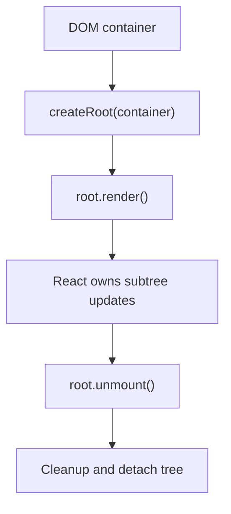

# Root Lifecycle

Будь-який React tree має точку входу: **root**. Саме root дає React ownership над DOM container, через нього починається rendering lifecycle і через нього ж subtree акуратно завершується.

---

## I. Core Mechanism

**Теза:** `createRoot(container)` створює React root, `root.render(element)` запускає або оновлює дерево в цьому контейнері, а `root.unmount()` акуратно знімає React tree разом з cleanup усіх прив'язаних ефектів і підписок.

### Приклад
```jsx
import { createRoot } from "react-dom/client";

const container = document.getElementById("app");
const root = createRoot(container);

root.render(<App />);
```

### Просте пояснення
Root це не просто “разовий старт”. Це об'єкт-контролер, через який React:

- прив'язується до конкретного DOM container;
- керує updates для цього subtree;
- вміє коректно завершити життя дерева.

### Технічне пояснення
У сучасному React client entrypoint іде через `react-dom/client` APIs:

- `createRoot(container)` для client-only mounting;
- `hydrateRoot(container, element)` для прив'язки до вже існуючого server-rendered HTML.

Після створення root:

1. `root.render(...)` ставить дерево під контроль React.
2. Подальші `root.render(...)` оновлюють той самий root.
3. `root.unmount()` відв'язує React від container і запускає teardown lifecycle.

Із React 19 legacy APIs `render`, `hydrate`, `unmountComponentAtNode` уже видалені на користь `createRoot`, `hydrateRoot` і `root.unmount()`.

### Visual Mental Model

> [!TIP]
> **[▶ Запустити інтерактивний Root Lifecycle Board](../../visualisation/mental-model-and-rendering/08-root-lifecycle/root-lifecycle-board/index.html)**



### Edge Cases / Підводні камені
- Не треба викликати `createRoot` на тому самому container багато разів.
- `root.render` не “додає ще один React app зверху”, а оновлює той самий root tree.
- `hydrateRoot` має окремі invariants: HTML має збігатися з очікуваним tree.
- Якщо зовнішній код видаляє DOM контейнер без `root.unmount()`, можна залишити subscriptions і side effects без cleanup.

---

## II. Common Misconceptions

> [!IMPORTANT]
> Root не дорівнює компоненту `App`. `App` лише верхівка tree, а root це host control boundary.

> [!IMPORTANT]
> `root.render()` не є старим `ReactDOM.render()` під новою назвою. Це частина нової client root model.

> [!IMPORTANT]
> Unmount важливий не лише для DOM cleanup, а і для effect cleanup.

---

## III. When This Matters / When It Doesn't

- **Важливо:** app bootstrapping, microfrontends, embedding React into existing pages, hydration, teardown safety.
- **Менш важливо:** якщо ти працюєш лише всередині framework bootstrap і ніколи не дивишся на entrypoint, але розуміти root усе одно корисно.

---

## IV. Self-Check Questions

1. Що створює `createRoot`?
2. Для чого існує root object?
3. Чим `root.render` відрізняється від `createRoot`?
4. Що робить `root.unmount()`?
5. Коли замість `createRoot` потрібен `hydrateRoot`?
6. Чому не варто створювати кілька roots на один і той самий container?
7. Чому unmount важливий для cleanup?
8. Що змінилося порівняно з legacy ReactDOM APIs?
9. Який зв'язок між root і subtree ownership?
10. Чи є `App` і root однією сутністю?

---

## V. Short Answers / Hints

1. React root controller.
2. Керувати життям subtree.
3. Один створює root, інший запускає/update-ить дерево.
4. Detach + cleanup.
5. Для server-rendered markup.
6. Бо ownership boundary має бути єдина.
7. Щоб коректно зняти effects/subscriptions/refs.
8. Старі APIs видалені, root model стала явною.
9. Root володіє всіма updates нижче себе.
10. Ні.

---

## VI. Suggested Practice

1. Напиши мінімальний bootstrap з `createRoot`, потім додай кнопку, яка монтує й анмаунтить root.
2. Намалюй lifecycle root від container до unmount без коду.
3. Після цієї статті переходь у [09 Strict Mode](../09-strict-mode/README.md), бо саме root boundary часто й обгортають у `<StrictMode>`.
