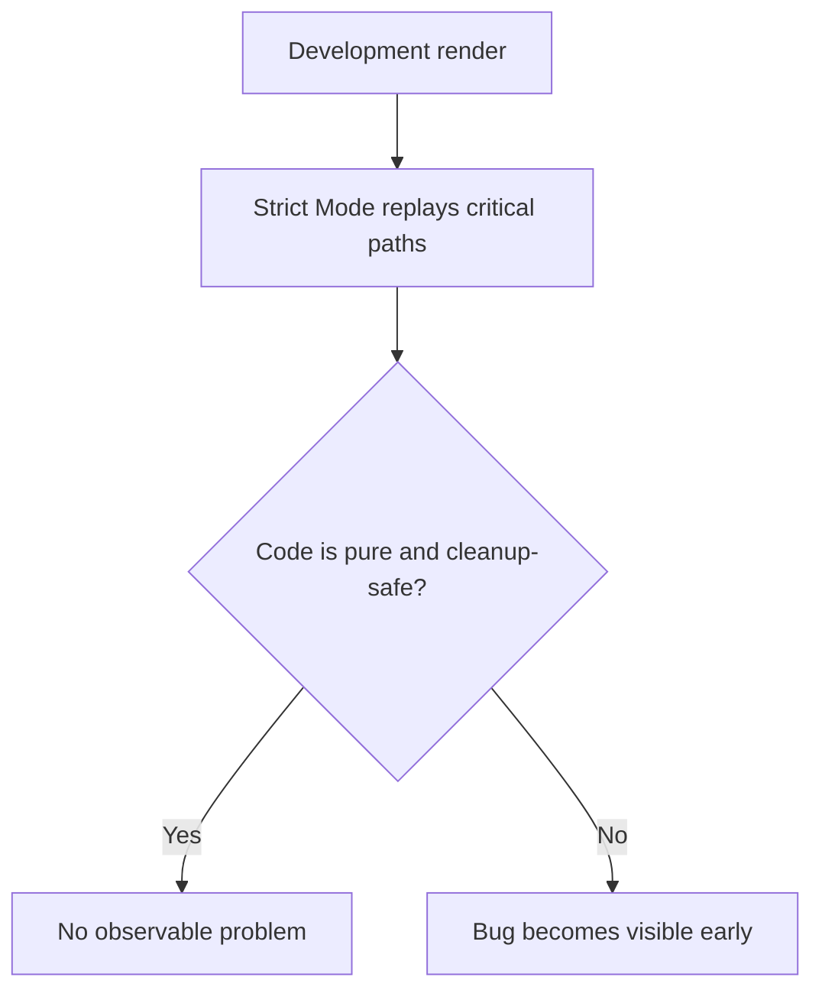

# Strict Mode

`<StrictMode>` не змінює production behavior напряму. Його задача в development: **агресивніше шукати impurity, missing cleanup і code paths, які не витримують повторного виконання**.

---

## I. Core Mechanism

**Теза:** Strict Mode в development навмисно повторно запускає певні шляхи render/effect/ref logic, щоб виявити код, який порушує React-модель purity і cleanup safety.

### Приклад
```jsx
import { StrictMode } from "react";

root.render(
  <StrictMode>
    <App />
  </StrictMode>
);
```

### Просте пояснення
Strict Mode це не “глюк, який двічі все рендерить”, а **тестовий стенд для runtime contract**. Якщо від повторного виклику компонент ламається, проблема в компоненті, а не в Strict Mode.

### Технічне пояснення
У development Strict Mode може:

- повторно викликати render logic;
- додатково проганяти effect setup/cleanup;
- повторно перевіряти ref callbacks;
- підсвічувати deprecated/unsafe patterns.

Мета: зловити код, який:

- мутує shared data під час render;
- забуває cleanup у effects;
- покладається на “цей код виконається лише раз”.

Важливо: це **development-only probe**, не production semantics.

### Visual Mental Model

> [!TIP]
> **[▶ Запустити інтерактивний Strict Mode Probe](../../visualisation/mental-model-and-rendering/09-strict-mode/strict-mode-probe/index.html)**



### Edge Cases / Підводні камені
- Подвійний `console.log` у dev ще не означає подвоєний production work.
- If effect setup duplicates subscription, Strict Mode часто покаже leak раніше.
- Код, який “працює тільки якщо викличеться раз”, already broken by model.
- Не треба прибирати Strict Mode лише щоб сховати симптом.

---

## II. Common Misconceptions

> [!IMPORTANT]
> Strict Mode не “ламає React”. Він викриває код, який уже не відповідає React contract.

> [!IMPORTANT]
> Dev-only repeated execution не означає, що production буде поводитися так само.

> [!IMPORTANT]
> Якщо компонент не витримує Strict Mode, проблема майже завжди в impurity або missing cleanup.

---

## III. When This Matters / When It Doesn't

- **Важливо:** development, code quality, effect cleanup, migration to modern React mental model.
- **Менш важливо:** лише коли ти аналізуєш production timing один-в-один; але навіть тоді Strict Mode важливий як діагностичний інструмент.

---

## IV. Self-Check Questions

1. Для чого існує Strict Mode?
2. Чи змінює він production behavior?
3. Чому repeated render у dev корисний?
4. Які типи багів він ловить найкраще?
5. Чому missing cleanup стає помітнішим у Strict Mode?
6. Чому подвійний лог не дорівнює подвійній production мутації?
7. Яка правильна реакція на Strict Mode bug: вимкнути його чи виправити код?
8. Чому Strict Mode пов'язаний з purity?
9. Чи означає “працює без Strict Mode”, що код правильний?
10. Який mental shift потрібен, щоб перестати боротися зі Strict Mode?

---

## V. Short Answers / Hints

1. Виявляти небезпечні патерни рано.
2. Ні, це dev-only.
3. Бо replay ламає impurity.
4. Side effects in render, missing cleanup, unsafe assumptions.
5. Бо setup/teardown перевіряється жорсткіше.
6. Бо commit semantics не тотожні render logs.
7. Виправити код.
8. Він перевіряє, чи render replay-safe.
9. Ні.
10. Мислити React як replayable runtime.

---

## VI. Suggested Practice

1. Візьми компонент, який пише у зовнішній масив під час render, і подивись, як Strict Mode це оголює.
2. Напиши effect без cleanup, потім додай cleanup і поясни різницю.
3. Після цієї статті переходь у [10 Rules of Hooks](../10-rules-of-hooks/README.md), бо Strict Mode і Rules of Hooks разом тримають структурну дисципліну React tree.
