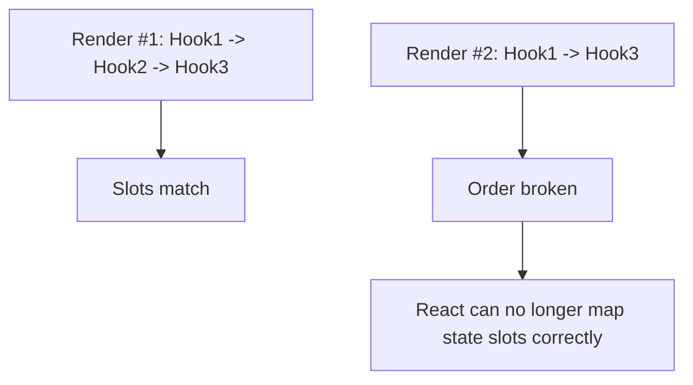

# Rules of Hooks as Slot/Order Invariant

Rules of Hooks часто вчать як “memorize this lint rule”, але корисна модель глибша: Hooks працюють, бо React прив'язує кожен hook call до **позиції в послідовності викликів** під час render.

---

## I. Core Mechanism

**Теза:** React очікує, що кожен render компонента викличе Hooks у **тому самому порядку**. Саме завдяки цьому він зіставляє hook state slots між renders.

### Приклад
```jsx
function Panel({ show }) {
  const [count, setCount] = useState(0);

  if (!show) {
    return null;
  }

  const [name, setName] = useState("");
  return <div>{count} {name}</div>;
}
```

### Просте пояснення
React не читає hook-и за назвою змінної. Він мислить приблизно так:

- перший hook call;
- другий hook call;
- третій hook call.

Якщо на наступному render другий call зник або змістився, mapping ламається.

### Технічне пояснення
Rules of Hooks практично означають:

1. Викликати Hooks лише на top level компонента або custom Hook.
2. Не викликати Hooks у циклах, умовах, вкладених функціях чи після раннього return, який змінює order.

Причина не стилістична, а структурна: React зберігає hook state відповідно до **call order per component render**. Тому одна й та сама компонентна позиція в tree повинна викликати один і той самий hook sequence.

### Visual Mental Model

> [!TIP]
> **[▶ Запустити інтерактивний Hook Slot Order](../../visualisation/mental-model-and-rendering/10-rules-of-hooks/hook-slot-order/index.html)**



### Edge Cases / Підводні камені
- Early return до частини Hooks теж може ламати invariant.
- Custom Hook окей, бо всередині він теж має стабільний order.
- Умовна логіка має бути **всередині Hook**, а не навколо виклику Hook.
- Lint rule `rules-of-hooks` важливий, але його треба розуміти через slot model.

---

## II. Common Misconceptions

> [!IMPORTANT]
> Rules of Hooks не існують “бо так придумали автори React”. Вони прямо випливають із того, як React зберігає hook state.

> [!IMPORTANT]
> “У цій умові hook спрацьовує рідко” все одно небезпечно. Проблема не в частоті, а в порушенні order.

> [!IMPORTANT]
> Custom Hook не обходить правила. Він просто інкапсулює той самий hook sequence.

---

## III. When This Matters / When It Doesn't

- **Важливо:** будь-який stateful function component, custom hooks, conditional rendering, refactors.
- **Менш важливо:** лише в компонентах без Hooks, але навіть там корисно мати цю mental model.

---

## IV. Self-Check Questions

1. Чому Hooks залежать від порядку виклику?
2. Що означає slot model?
3. Чому Hook не можна викликати всередині `if`?
4. Чому цикл з Hook calls теж небезпечний?
5. Чому early return може ламати invariant?
6. Чому custom Hook дозволений?
7. Як React відрізняє “перший useState” від “другого useState”?
8. Чим lint rule допомагає, але не замінює mental model?
9. Де має жити умовна логіка: навколо Hook чи всередині нього?
10. Що саме ламається, коли hook order зсувається?

---

## V. Short Answers / Hints

1. Бо state slots матчаться за call order.
2. Кожен hook call займає позицію-слот.
3. Бо sequence між renders зміниться.
4. Бо кількість і позиції calls стають нестабільними.
5. Бо частина hooks може не викликатися.
6. Бо він викликається як стабільний top-level block.
7. За позицією в sequence, а не за назвою.
8. Lint ловить патерн, mental model пояснює чому.
9. Усередині Hook або після нього, але не через умовний сам виклик.
10. Mapping state/effect/ref slots.

---

## VI. Suggested Practice

1. Візьми 10 прикладів з умовними Hooks і перепиши їх так, щоб зберегти top-level order.
2. Намалюй для компонента hook sequence на двох renders і перевір, чи invariant зберігається.
3. Після цієї статті повтори весь блок через [README модуля](../README.md) і зв'яжи разом purity, render snapshots, React orchestration і hook slots в одну модель.
